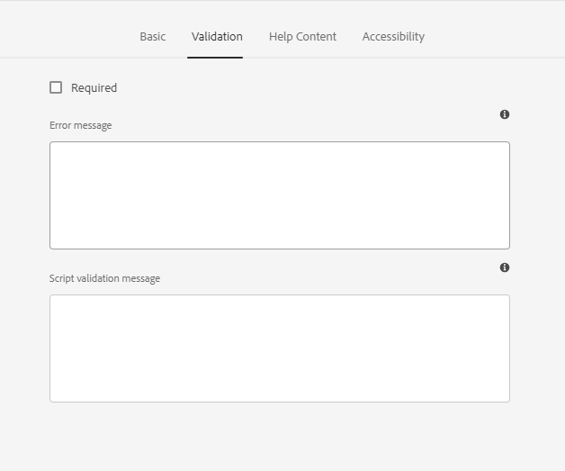
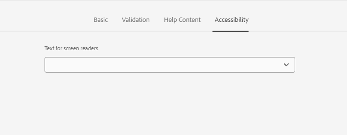

# 自适应表单ImageChoice字段 {#image-choice}

表单中的“图像选择”组件允许用户基于可视表示法（如图像）进行选择，而不是基于文本的选项。 它呈现一系列图像，每个图像代表不同的选择。 用户可以选择一个或多个图像，其中视觉反馈指示他们的选择。 此组件对于产品变体、调查答案或个人资料图片等选项非常有用。 它提供了一种直观、美观的选择方法，从而增强了用户参与度和清晰度。

## 用途

图像选择组件具有以下几个主要功能：

- **图像呈现：**&#x200B;用户将看到图像，而不是传统的文本标签或单选按钮。 每个图像对应于它们可以选择的选项，提供可用选项的可视表示形式。

- **可单击的图像：**&#x200B;用户可以通过直接单击该图像来选择选项。 所选图像通常会突出显示，以表示已选择该图像。

- **单选或多选：**&#x200B;根据组件的设计，用户可以选择单个图像或多个图像。

## 版本和兼容性 {#version-and-compatibility}

自适应Forms图像选择组件作为核心组件2.0.64的一部分发布。 下表显示所有支持的版本、AEM 兼容性以及相应文档的链接：

| 组件版本 | AEM as a Cloud Service |
|---|---|
| v1 | 与 [版本 2.0.64](/help/adaptive-forms/version.md) 和更高版本兼容 |

有关核心组件版本的信息，请参阅[核心组件版本](/help/adaptive-forms/version.md)文档。

## 技术详细信息 {#technical-details}

在[GitHub](https://github.com/adobe/aem-core-forms-components/tree/master/ui.af.apps/src/main/content/jcr_root/apps/core/fd/components/form/)上的技术文档中获取有关自适应Forms图像选择核心组件的最新信息。 有关开发核心组件的更多信息，请参阅[核心组件开发人员文档](/help/developing/overview.md)。

## “配置”对话框 {#configure-dialog}

通过“配置”对话框，您可以轻松自定义访客的图像选择组件体验。

### “基本”选项卡 {#basic-tab}

- **名称** - 可在表单和规则编辑器中通过唯一名称轻松地标识表单组件，但该名称不得包含空格或特殊字符。

- **标题** — 通过标题，您可以轻松地在自适应表单中识别组件类型，默认情况下，标题显示在组件的旁边。

- **隐藏标题** — 您可以通过选中“隐藏标题”框来隐藏标题。

- **选项** — 它可帮助您添加单个或多个映像并自定义映像选择属性。 图像选择属性包括每个图像的数据值、图像引用资源和Alt文本。

- **绑定引用** - 绑定引用是对存储在外部数据源中并在表单中使用的数据元素的引用。 通过绑定引用，可动态地将数据绑定到表单字段，以使表单可显示来自数据源的最新数据。

  例如，可使用绑定引用，根据输入到表单中的客户 ID，在该表单中显示该客户的姓名和地址。 还可使用绑定引用，通过输入到表单中的数据更新数据源。 这样通过 AEM Forms 即可创建与外部数据源交互的表单，从而为收集和管理数据提供一种无缝的用户体验。

- **标记为未绑定表单元素**：选择此选项可配置未链接到任何架构的表单字段。 利用此选项，您可以保存数据而不更新数据源。 它还可让您以一种独立于标准数据库集成的自定义方式处理数据。

- **提交的值的数据类型**：此选项指定在选择任何选项时发送的值的数据类型。 如果将&#x200B;**提交的值的数据类型**&#x200B;设置为 `Number`，而您在&#x200B;**选项**&#x200B;选项卡上将字符串数据添加到&#x200B;**数据值**，则屏幕显示一条 `Value type mismatch` 错误消息。

- **显示选项**：它为您提供水平或垂直显示图像选择字段的选项。

- **默认值**：此选项允许您在表单字段中添加默认值（数据值）。 如果选择了&#x200B;**已禁用的组件**&#x200B;或&#x200B;**只读组件**，则屏幕上将显示默认值。 如果用户在表单字段中未输入值，则在提交表单时提交此值。

- **隐藏组件**：选择该选项以在表单中隐藏该组件。 仍可访问该组件作其他用途，如在规则编辑器中使用它进行计算。 当需要存储用户无需看到或直接更改的信息时，此项很有用。

- **禁用组件**：选择选项以禁用或锁定该组件。 被禁用的组件不再活跃或最终用户无法编辑它。 用户可看到但无法修改字段的值。 仍可访问该组件作其他用途，如在规则编辑器中使用它进行计算。

- **只读**：此选项允许您在表单字段中添加默认值（数据值）。 如果选择了&#x200B;**已禁用的组件**&#x200B;或&#x200B;**只读组件**，则屏幕上将显示默认值。 如果用户在表单字段中未输入值，则在提交表单时提交此值。

- **选择类型**：此选项允许用户选择单个或多个图像选择字段。

### “验证”选项卡 {#validation-tab}

- **必需** - 如果要在自适应表单中显示该组件，请选中此选项。 选择此选项后，您必须先做出选择，之后才能继续提交表单。 如果选择此选项，则无法在&#x200B;**基本{3**&#x200B;选项卡中选择&#x200B;**隐藏组件**&#x200B;或{禁用组件。**

- **错误消息** — 此选项允许您输入在选中&#x200B;**必需**&#x200B;复选框并且未选中图像选择字段时显示的消息。

- **脚本验证消息** - 通过此选项，可输入如果脚本验证失败，所显示的消息。

### “帮助内容”选项卡 {#helpcontent-tab}

- **简短描述** - 简短描述是一段简短的文字说明，其中提供关于特定表单字段的用途的其他信息或阐述。 它帮助用户了解应将什么类型的数据输入到字段中，并可提供准则或示例以帮助确保所输入的信息有效且符合预期的标准。 默认情况下，简短描述保持隐藏状态。 启用&#x200B;**始终显示简短描述**&#x200B;选项以在组件下方显示它。

- **始终显示简短描述** - 启用该选项以在组件下方显示简短描述。

- **帮助文本** - 帮助文本是指提供给用户以帮助其正确填写表单字段的其他信息或指导。 当用户单击组件旁的“帮助”图标 (i) 时显示它。 帮助文本提供比表单字段的标签或占位符文本更详细的信息，旨在帮助用户了解该字段的要求或限制。 它还可提供建议或示例，以使填写表单更轻松且更准确。

### “辅助功能”选项卡 {#accessibility-tab}

- **屏幕阅读器文本** - 屏幕阅读器文本是指供由视障人士使用的屏幕阅读器等辅助技术读取的附加文本。 此文本提供表单字段用途的音频描述，并可包括关于字段的标题、描述、名称和任何相关消息（自定义文本）的信息。 屏幕阅读器文本帮助确保包括视障用户在内的所有用户均可访问表单，并使其完整地了解表单字段及其要求。
   - **自定义文本**：选中此选项以将自定义文本用于 ARIA 辅助功能标签。 选中此选项将显示“自定义文本”对话框。 可在“自定义文本”对话框中添加相关信息。
   - **标题**：选中此选项以将标题用于 ARIA 辅助功能标签。

## 相关文章 {#related-articles}

{{more-like-this}}

## 另请参阅 {#see-also}

{{see-also}}

