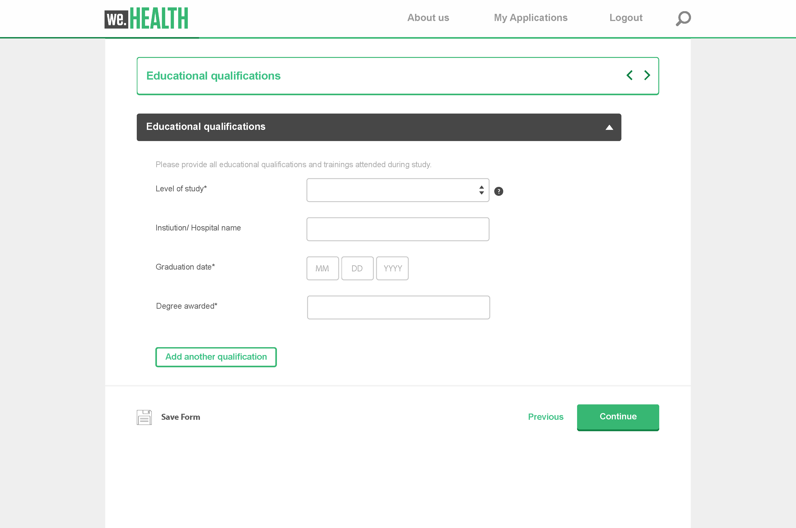

# 自适应表单核心组件简介 {#adaptive-forms-core-components-introduction}

使用 Adobe Experience Manager 中的自适应表单核心组件，您可以利用灵活性和可用的自定义选项创建引人入胜的注册体验。

## 核心组件  {#overview}

在 Adobe Experience Manager (AEM) 中，组件是用于创建页面和表单的构建基块。它们使作者能够通过一种简单而强大的方式创建和管理内容，并为开发人员提供了创建自定义组件所需的灵活性和可扩展性。它们旨在加快开发时间并降低网站和表单的维护成本，其操作灵活并且可以轻松定制，以满足网站和表单的特定需求。

此外，核心组件经过设计，具有响应能力并支持一系列广泛的设备，包括台式机、平板电脑和智能手机。它们还遵循最新的 Web 标准和最佳实践，这使其成为用于创建 Web 内容的强大且可靠的解决方案。

总的来说，核心组件是用于在 AEM 中创建和管理 Web 内容的重要工具，它提供了强大而灵活的解决方案，可帮助减少开发时间和维护成本，同时还为网站访客提供出色的用户体验。

## 自适应表单核心组件

自适应表单核心组件是一组（24 个）开源且与 BEM 兼容的组件，它们基于 Adobe Experience Manager WCM 核心组件而构建。它们专门设计用于创建自适应表单，后者是能够适应用户的设备、浏览器和屏幕大小的表单。

利用这些组件，可提供一系列广泛的表单字段选项（包括文本字段、复选框、下拉菜单等）来创建卓越的数据捕获和注册体验。它们还包括验证、条件逻辑和响应式设计等功能，可用于创建用户友好且易用的表单。

此外，由于这些组件是开源的，因此，开发人员能够轻松定制和扩展组件以满足其组织的特定需求。而且，这些组件基于 BEM 方法而构建，这确保了它们可扩展且可维护。

## 功能 {#features}

|  |  |
|---|---|
| 可以即刻投入使用 | 自适应表单核心组件是 24 个功能强大的 WCM 组件。 |
| 云就绪 | 适用于 [AEM Forms as a Cloud Service](https://experienceleague.adobe.com/docs/experience-manager-cloud-service/content/forms/home.html)。 |
| 可以通用 | 这些组件代表了表单作者可用来设计几乎任何布局的通用概念。 |
| 可配置 | 模板级[内容策略](https://experienceleague.adobe.com/docs/experience-manager-cloud-service/content/implementing/developing/full-stack/components-templates/templates.html#content-policies)定义了可以使用或无法使用的功能。 |
| 可访问 | 它们提供 ARIA 标签，支持键盘导航（[已知问题](https://github.com/adobe/aem-core-wcm-components/issues?utf8=✓&amp;q=is%3Aissue+is%3Aopen+accessibility+in%3Atitle)）以及用于屏幕阅读器等辅助技术的文本。 |
| 可主题化 | 这些组件实施[样式系统](https://experienceleague.adobe.com/docs/experience-manager-cloud-service/content/sites/authoring/features/style-system.html)，且标记遵循 [BEM CSS 约定](https://getbem.com/)。 |
| 可自定义 | 可利用几种模式来轻松进行自定义设置（从调整 HTML 到高级功能重用）。 |
| 版本控制 | [版本控制策略](https://github.com/adobe/aem-core-wcm-components/wiki/Versioning-policies)可确保核心组件在改进可能影响您的内容时不会中断您的网站。 |
| 开源 | 如果有出错的地方，请做出您的改进。 |

<!-- comply with [WCAG 2.1 standard](https://www.w3.org/TR/WCAG21/), -->

## 好处 {#benefits}

数据捕获体验对于商机开发和注册至关重要，自适应表单核心组件提供了功能强大的解决方案来创建针对数据捕获优化的表单。使用核心组件在基础组件上创建这些体验的一些益处包括：

* **可在 GitHub 上获得并提供内容全面的文档**：AEM Adaptive Forms 核心组件是开源的，可在 GitHub 上获得，并提供全面的文档。这使开发人员能够更容易理解相关组件及其工作方式，并为其开发做出贡献。[Aemcomponents.dev](https://www.aemcomponents.dev/) 网站也是一项宝贵的资源，开发人员可以在其中查看正在运行的组件并访问详细的文档。

* **样式的 BEM 模型**：核心组件遵循 BEM（块元素修饰符）样式模型，这是一种行之有效且广泛使用的 CSS 组织方法。这使开发人员更容易理解相关样式的组织方式，以及如何修改它们，以满足其特定需求。

* **不依赖第三方库**：核心组件的优势之一是它们不依赖于第三方 JavaScript 库，包括 JQuery 和 Underscore。这使得组件能够更快、更轻巧，并且更容易集成到现有的 AEM 实施中。

* **专注于性能和可访问性**：核心组件在构建时考虑到了性能和可访问性，这反映在其较高的 Google Lighthouse 和 Web Vitals 得分中。这使开发人员可以更轻松地创建可访问且高性能的网页，而这在当今的数字环境中越来越重要。

* **Sites 30 模板和主题中的表单组件**：核心组件为 Sites 30 模板和主题中的表单组件提供支持，使开发人员可以更轻松地在 AEM 中创建和自定义表单。

* **更容易设计样式**：与对应的基础组件相比，核心组件更容易设计样式。 主题创建过程类似于 Sites，并且能够从父 Sites 页面继承相同的主题/CSS。此外，用于样式的 BEM 模型使理解和修改各个样式变得更加容易。

* **辅助功能**：自适应表单核心组件支持辅助功能标准和指南，以确保残障人士（包括那些使用屏幕阅读器等辅助技术的人员）能够使用表单。

## 自适应表单核心组件 {#components}

当前版本的自适应表单核心组件具有以下所列组件。

* [折叠](/help/adaptive-forms/components/accordion.md)
* [按钮](/help/adaptive-forms/components/button.md)
* [复选框组](/help/adaptive-forms/components/checkbox-group.md)
* [日期选取器](/help/adaptive-forms/components/date-picker.md)
* [下拉列表](/help/adaptive-forms/components/drop-down.md)
* [电子邮件输入](/help/adaptive-forms/components/email-input.md)
* [表单容器](/help/adaptive-forms/components/form-container.md)
* [文件附件](/help/adaptive-forms/components/file-attachment.md)
* [页脚](/help/adaptive-forms/components/footer.md)
* [页眉](/help/adaptive-forms/components/header.md)
* [水平选项卡](/help/adaptive-forms/components/horizontal-tabs.md)
* [图像](/help/adaptive-forms/components/image.md)
* [数值输入](/help/adaptive-forms/components/number-input.md)
* [面板容器](/help/adaptive-forms/components/panel-container.md)
* [单选按钮](/help/adaptive-forms/components/radio-button.md)
* [“重置”按钮](/help/adaptive-forms/components/reset-button.md)
* [“提交”按钮](/help/adaptive-forms/components/submit-button.md)
* [电话号码输入](/help/adaptive-forms/components/telephone-input.md)
* [文本输入](/help/adaptive-forms/components/text-input.md)
* [文本](/help/adaptive-forms/components/text.md)
* [标题](/help/adaptive-forms/components/title.md)
* [向导](/help/adaptive-forms/components/wizard.md)

## 设置核心组件

自适应表单核心组件具有以下要求。

| AEM | AEM Forms 附加组件 | 核心组件 |
|---|---|---|
| AEM as a Cloud Service | 表单 - 数字注册 | [版本 2.20.8](version.md) 以上 |
| AEM 6.5 | Forms 附加组件 | [版本 1.1.12](version.md) 以上 |

### 基于核心组件创建自适应表单

**AEM Forms as a Cloud Service**：当您创建新的 AEM Forms as a Cloud Service 程序时，即为您的环境启用自适应表单核心组件。如果您有基于 Archetype 39 或更早版本的 Forms as a Cloud Service 环境，请[为您的环境启用自适应表单核心组件](https://experienceleague.adobe.com/docs/experience-manager-cloud-service/content/forms/setup-configure-migrate/setup-local-development-environment.html?#enable-adaptive-forms-core-components-for-an-existing-aem-archetype-based-project)。

在为您的环境启用核心组件时，即将&#x200B;**自适应表单（核心组件）**&#x200B;模板和画布主题添加到您的环境。如果您的 AEM SDK 版本低于 2023.02.0，请[确保在您的环境上启用 `prerelease` 标志](https://experienceleague.adobe.com/docs/experience-manager-cloud-service/content/release-notes/prerelease.html?lang=zh-Hans#new-features)，因为自适应表单核心组件是 2023.02.0 发布之前预发布的一部分。

要使用自适应表单向导和自适应表单编辑器创建自适应表单，请参阅“创建自适应表单（[核心组件](https://experienceleague.adobe.com/docs/experience-manager-cloud-service/content/forms/adaptive-forms-authoring/authoring-adaptive-forms-core-components/create-an-adaptive-form-on-forms-cs/creating-adaptive-form-core-components.html?)）”。

<!-- >, such as  [WCAG 2.1 standard](https://www.w3.org/TR/WCAG21/), to ensure that forms can be used by people with disabilities, including those using assistive technologies such as screen readers.

*   **Alignment with AEM Sites**: The Core Components are designed to be more aligned with AEM Sites, making it easier for Sites users to adopt and use them without having to learn anything new. The components use the same front-end pipeline as Sites, making it easier to style and modify their appearance. 

<!-- Additionally, the following points further illustrate this alignment:

    *   **Authoring experience inline with Page editor**: The Core Components have an authoring experience that is inline with the Sites editor, with dialogs and other experiences similar to the Page editor. This makes it easier for Sites users to create and manage forms within the familiar context of the Sites editor.

    *   **Inline form editing in Sites editor**: The Core Components allow  inline form editing within the Sites editor, avoiding the need to switch back and forth between editors. This streamlines the authoring experience and makes it easier to create and manage forms.

    *   **Inheriting Sites features in Forms**: Forms authored within a Sites page inherit the same features as Sites. This provides a seamless and integrated experience for creating and managing forms within the context of AEM Sites 
    
    <!--including Multi Site Manager, the ability to use Sites components within a form for static content, support for scheduled publish/unpublish, form translation aligned with Sites translation, versioning, and targeting -->
