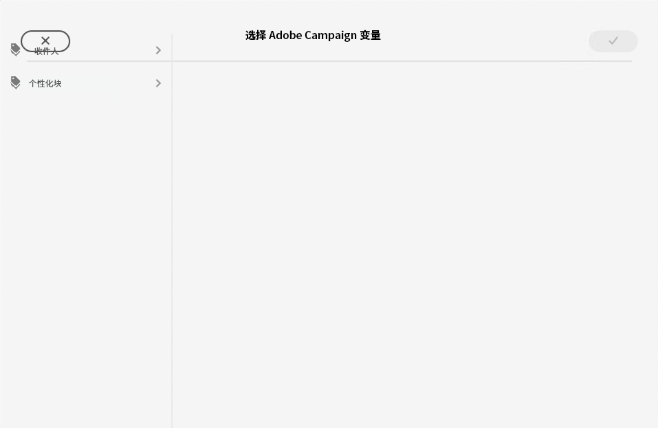
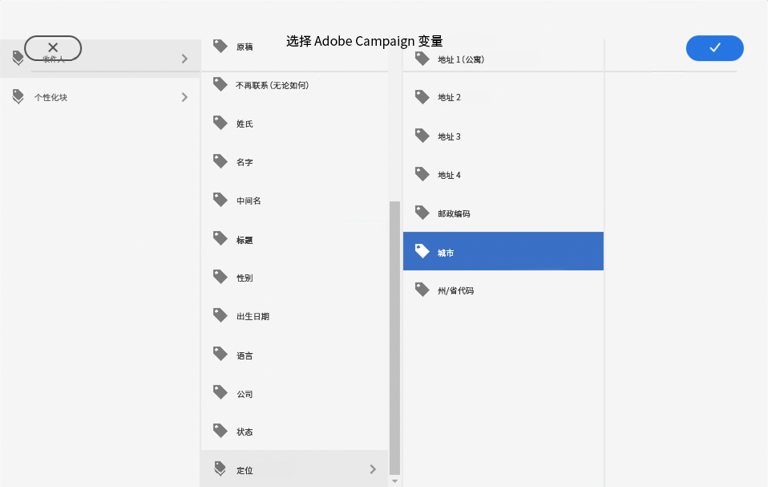
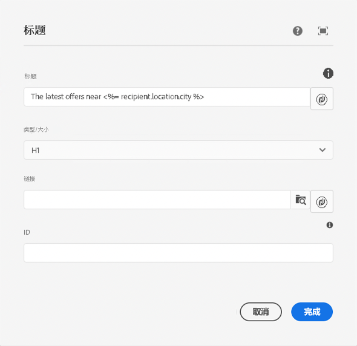

# Campaign 变量 {#campaign-variables}

使用 Campaign 变量来撰写个性化的电子邮件内容。 Campaign 变量充当您可以插入到电子邮件内容中的 Adobe Campaign 值的占位符。 通过 Adobe Campaign 发送内容时，Campaign 会将这些变量替换为收件人的个性化内容。

## 用途 {#usage}

电子邮件核心组件可通过常用文本字段旁边的个性化按钮轻松访问 Campaign 变量。按下时，会出现一个对话框，您可以从中选择个性化字段。

可用个性化字段列表与您的 Adobe Campaign 实例同步。 这些字段在 Adobe Campaign 中的架构 `nms:seedMember` 中进行管理。`nms:seedMember` 中的所有字段也必须出现在您的收件人表中。

## 选择 Adobe Campaign 变量对话框 {#dialog}

选择 Adobe Campaign 变量对话框在电子邮件核心组件的许多编辑对话框中可用。 要使用它，只需单击适用字段旁边的&#x200B;**选择 Adobe Campaign 变量**&#x200B;图标。 这个图标可以有两种形式。

单击这两个图标将打开&#x200B;**选择 Adobe Campaign 变量**&#x200B;对话框。

使用列视图定位您要插入的变量。 单击列中的节点会在右侧的新列中显示其子节点。 通过这种方式，您可以导航可变的内容结构。

选择要插入的变量，然后单击对话框右上角的复选标记。

然后将该变量插入到电子邮件核心组件的编辑对话框的字段中。

随时单击对话框左上角的 X 可取消并关闭对话框。
