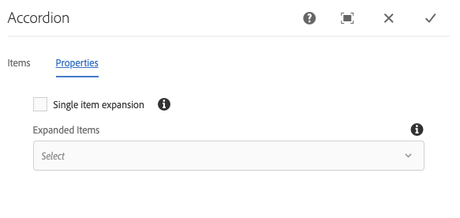

# Accordion Component{#accordion-component}

核心组件折叠组件允许创建一组在页面上折叠的面板中排列的面板。

## 使用情况 {#usage}

The Core Component Accordion component allows for the creation of a collection of components, composed as panels, and arranged in an accordion on a page, similar to the [Tabs Component](tabs.md), but allows for expanding and collapsing of the panels.

* The accordion&#39;s properties can be defined in the [configure dialog](#configure-dialog).
* The order of the panels of the accordion can be defined in the configure dialog as well as the [select panel popover](#select-planel.md).
* Defaults for the Accordion Component when adding it to a page can be defined in the [design dialog](#design-dialog).

## Version and Compatibility {#version-and-compatibility}

Accordion Component的最新版本为v1，它是在2019年月版的核心组件中引入的，它在本文档中进行了介绍。

下表详细说明了组件的所有支持版本、组件版本的AEM版本以及以前版本的文档链接。

| 组件版本 | AEM 6.3 | AEM 6.4 | AEM 6.5 |
|--- |--- |--- |---|
| v1 | 兼容 | 兼容 | 兼容 |

For more information about Core Component versions and releases, see the document [Core Components Versions](versions.md).

## Sample Component Output {#sample-component-output}

To experience the Accordion Component as well as see examples of its configuration options as well as HTML and JSON output, visit the [Component Library](http://opensource.adobe.com/aem-core-wcm-components/library/accordion.html).

## Technical Details {#technical-details}

The latest technical documentation about the Accordion Component [can be found on GitHub](https://github.com/adobe/aem-core-wcm-components/tree/master/content/src/content/jcr_root/apps/core/wcm/components/accordion/v1/accordion).

Further details about developing Core Components can be found in the [Core Components developer documentation](developing.md).

## Configure Dialog {#configure-dialog}

配置对话框允许内容作者定义折叠项目、其面板及其行为，并为访客显示页面。

### Items Tab {#items-tab}

Use the **Add** button to open the component selector to choose which component to add as a panel. 添加后，条目会添加到列表中，其中包含以下列：

* **图标** -面板的组件类型的图标，用于在列表中轻松标识。将鼠标悬停在鼠标上可查看整个组件名称作为工具提示。
* **描述** -用作面板文本的说明，默认为面板所选组件的名称。
* **删除** -点按或单击可从折叠组件中删除面板。
* **重新排列** -点按或单击并拖动可重新排列面板的顺序。

### Properties Tab {#properties-tab}

* **单个项目扩展** -选中此选项后，此选项会强制一次展开一个折叠项目。展开一个项目后，将折叠所有其他项目。
* **扩展的项目** -此选项定义加载页面时默认展开的项目。
   * When **Single item expansion** is selected, one panel must be selected. 默认情况下，第一个面板处于选中状态。
   * When **Single item expansion** is not selected, this option is a multi-select and is optional.

## Select Panel Popover {#seelct-panel-popover}

The content author can use the **Select Panel** option on the component toolbar to change to a different panel for editing as well as to easily rearrange the order of the panels within the accordion.

Once selecting the **Select Panel** option in the component toolbar, the configured accordion panels are displayed as a drop-down.

* 列表由分配的面板排列排序，并反映在编号中。
* 将首先显示该面板的组件类型，后跟浅体字体的说明。
* 点击或单击下拉菜单中的条目，将编辑器中的视图切换到该面板。
* 使用拖动手柄可以就地重新排列面板。

## Design Dialog {#design-dialog}

设计对话框允许模板作者定义使用Accordion组件的内容作者和放置Accordion组件时设置的默认选项。

### Properties Tab {#properties-tab-design}

* **允许的标题元素** -此多选下拉菜单定义允许作者选择的可折叠项目标题HTML元素。
* **默认标题元素** -此下拉菜单定义默认折叠项目标题HTML元素。

### Allowed Components Tab {#allowed-components-tab}

**允许的组件** 选项卡用于定义可将哪些组件作为项目添加到内容作者的Accordion组件中的面板。

The Allowed Components tab functions in the same way as the tab of the same name when [defining the policy and properties of a Layout Container in the Template Editor.](https://helpx.adobe.com/experience-manager/6-5/sites/authoring/using/templates.html)

### Styles Tab {#styles-tab}

The Accordion Component supports the AEM [Style System](authoring.md#component-styling).
