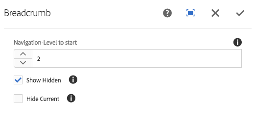

# 痕迹导航组件(v1){#breadcrumb-component-v}

核心组件痕迹导航组件是一个导航组件，它根据页面在内容层次结构中的位置构建了链接痕迹导航。

## 使用情况 {#usage}

痕迹导航组件显示站点层次结构中当前页面的位置，允许页面访问者从其当前位置导航页面层次结构。这通常集成到页眉或页脚中。

默认导航级别以及显示当前页面或隐藏页面的能力可由设计对话框中的模板作者 [定义](breadcrumb-v1.md#main-pars_title_1995166862)。内容编辑器随后可以选择是否应显示隐藏页面以及 [编辑对话框中组件的实际导航级别](breadcrumb-v1.md#main-pars_title)。

## 版本和兼容性 {#version-and-compatibility}

本文档描述了Breadcrumb Component的v1，该组件最初随AEM6.3的核心组件版本1.0.0一起引入。

下表列出了痕迹导航组件的v1的兼容性。

| AEM 版本 | 痕迹导航组件v1 |
|--- |--- |
| 6.3 | 兼容 |
| 6.4 | 兼容 |

>[!CAUTION]
>
>本文档描述了痕迹导航组件的v1。
>有关痕迹导航组件的当前版本的详细信息，请参阅 [痕迹导航组件](breadcrumb.md) 文档。

## 示例组件输出 {#sample-component-output}

以下示例取自 [We. Retail](https://helpx.adobe.com/experience-manager/6-4/sites/developing/using/we-retail.html)。

### 屏幕快照 {#screenshot}


### HTML {#html}

```
<div class="cmp cmp-breadcrumb aem-GridColumn aem-GridColumn--default--12">

<ol class="breadcrumb">
    <li class="breadcrumb-item ">
        <a href="/content/we-retail/us.html">
            United States
        </a>
    </li>

    <li class="breadcrumb-item ">
        <a href="/content/we-retail/us/en.html">
            English
        </a>
    </li>

    <li class="breadcrumb-item active">
        
            Experience
        
    </li>
</ol>
 
</div>
```

### JSON {#json}

```
"breadcrumb": {
              "columnClassNames": "aem-GridColumn aem-GridColumn--default--12",
              ":type": "weretail/components/content/breadcrumb"
            }
```

>[!NOTE]
>
>核心组件中的JSON导出需要核心组件版本1.1.0。有关更多信息，请参见核心组件v [](versions.md#main-pars_title_236368006) 的兼容性信息。

## 编辑对话框 {#edit-dialog}

编辑对话框允许内容作者禁止痕迹导航中的隐藏和活动页面以及纵向应显示的层次结构中的深度。



* **导航级别到开始** -在层次结构中，痕迹导航组件应开始向下导航到当前页面。例如We. Retail：

   * 开始1 `/content/we-retail`
   * 开始时开始 `/content/we-retail/<country>`

* **显示隐藏** -在痕迹导航中显示标记为隐藏的页面(默认情况下不显示它们)
* **隐藏当前**页面隐藏痕迹导航中的当前页面(默认情况下将显示)

## 设计对话框 {#design-dialog}

设计对话框允许模板作者定义默认值，这些值用于禁止痕迹导航中隐藏和活动页面的隐藏以及其应显示的层次结构中的深度。


* **导航级别到开始-** 定义在将痕迹导航组件添加到页面时，痕迹导航组件应开始向下导航至当前页面的默认值。
* **显示隐藏** -定义将痕迹导航组件添加到页面时 **显示隐藏** 选项的默认值。

   * 它不为作者启用或禁用选项。它只设置默认值。

* **隐藏当前** 值-定义将痕迹导航组件添加到页面时 **“隐藏当前”** 选项的默认值。

   * 它不为作者启用或禁用选项。它只设置默认值。

## 技术详细信息 {#technical-details}

有关痕迹导航组件 [的最新技术文档可在GitHub](https://github.com/adobe/aem-core-wcm-components/tree/master/content/src/content/jcr_root/apps/core/wcm/components/breadcrumb/v1/breadcrumb)上找到。

可以从GitHub下载整个核心组件项目。

有关开发核心组件的更多详细信息，请参阅 [核心组件开发人员文档](developing.md)。
