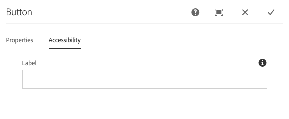

# 按钮组件{#button-component}

核心组件按钮组件允许在页面上配置和显示按钮项。

## 使用情况 {#usage}

核心组件按钮组件允许在页面中包含按钮。

* 可在配置对话框中选择按钮的 [属性](#configure-dialog)。
* 可在设计对话框中定义按钮组件的 [样式](#design-dialog)。

## 版本和兼容性 {#version-and-compatibility}

按钮组件的当前版本为v1,v1是2019年6月随核心组件版本2.5.0引入的，本文档对此进行了说明。

下表详细列出了组件的所有受支持版本、与组件版本兼容的AEM版本，以及指向先前版本的文档的链接。

| 组件版本 | AEM 6.3 | AEM 6.4 | AEM 6.5 | AEM作为云服务 |
|--- |--- |--- |---|---|
| v1 | 兼容 | 兼容 | 兼容 | 兼容 |

有关核心组件版本和版本的详细信息，请参阅文档核 [心组件版本](versions.md)。

## 示例组件输出 {#sample-component-output}

要体验“按钮”组件，并查看其配置选项的示例以及HTML和JSON输出，请访问“组件 [库”](https://adobe.com/go/aem_cmp_library_button)。

## 技术详细信息 {#technical-details}

有关“按钮组件”的最新技 [术文档可在GitHub上找到](https://adobe.com/go/aem_cmp_tech_button_v1)。

有关开发核心组件的更多详细信息，请参阅核 [心组件开发人员文档](developing.md)。

## 配置对话框 {#configure-dialog}

配置对话框允许内容作者定义按钮及其行为和对页面访客的显示方式。

### 属性选项卡 {#properties-tab}

* **文本** -要在按钮上显示的文本
* **链接** -链接到AEM中的内容页面、外部资源或锚点
   * 使用“ **选择”对话框** ，在AEM中选择路径。
* **图标** -用于在按钮中显示图标的标识符

### 辅助功能选项卡 {#accessibility-tab}

在“辅 **助功能** ”选项卡上 [，可为组件的](https://www.w3.org/WAI/standards-guidelines/aria/) ARIA辅助功能标签设置值。

* **标签** -组件的ARIA标签属性的值

## 设计对话框 {#design-dialog}

### 样式选项卡 {#styles-tab}

图像组件支持AEM样 [式系统](authoring.md#component-styling)。
