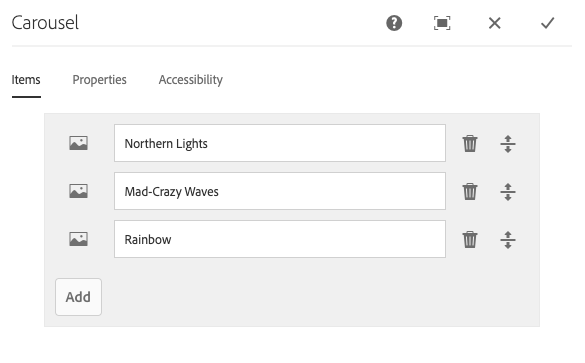
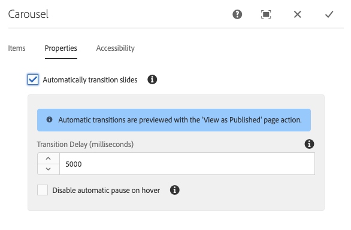
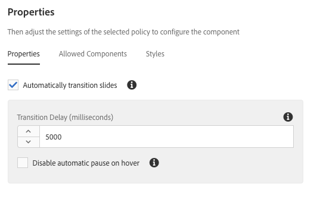

# 传送组件{#carousel-component}

核心组件传送组件允许内容作者在可导航的传送中显示内容。

## 使用情况 {#usage}

使用传送组件，内容作者可以在旋转的幻灯片传送中组织内容。

通过 [编辑对话框](#edit-dialog) ，内容作者可以创建、命名和排序多张幻灯片，并可以延迟地启用自动过渡。 使用设 [计对话框](#design-dialog)，模板作者可以定义可添加到传送的组件、启用或禁用自动过渡以及自定义样式。

## 版本和兼容性 {#version-and-compatibility}

传送组件的当前版本为v1,v1是2018年10月随核心组件版本2.2.0引入的，本文档对此进行了说明。

下表详细列出了组件的所有受支持版本、与组件版本兼容的AEM版本，以及指向先前版本的文档的链接。

| 组件版本 | AEM 6.3 | AEM 6.4 | AEM 6.5 |
|--- |--- |--- |--- |
| v1 | 兼容 | 兼容 | 兼容 |

有关核心组件版本和版本的详细信息，请参阅文档核 [心组件版本](versions.md)。

## 示例组件输出 {#sample-component-output}

要体验传送组件以及查看其配置选项以及HTML和JSON输出的示例，请访问组件 [库](http://opensource.adobe.com/aem-core-wcm-components/library/carousel.html)。

### 技术详细信息 {#technical-details}

有关传送组件的最新技术文 [档可在GitHub上找到](https://github.com/adobe/aem-core-wcm-components/blob/master/content/src/content/jcr_root/apps/core/wcm/components/carousel/v1/carousel)。

有关开发核心组件的更多详细信息，请参阅核 [心组件开发人员文档](developing.md)。

## Edit Dialog {#edit-dialog}

编辑对话框允许内容作者添加、重命名和重新排列幻灯片，并定义自动过渡设置。

### 项目选项卡 {#items-tab}

使用添 **加按钮** ，打开组件选择器以选择要添加为选项卡的组件。 添加后，一个条目将添加到列表，其中包含以下列：

* **图标** -选项卡的组件类型图标，可在列表中轻松识别。 将鼠标悬停在上方，可将完整组件名称作为工具提示查看。
* **说明** -用作选项卡文本的说明，默认使用为选项卡选择的组件的名称。
* **删除** -点按或单击，以从选项卡组件中删除选项卡。
* **重新排序** -点按或单击并拖动以对选项卡进行排序。

### 属性选项卡 {#properties-tab}

在“属 **性** ”选项卡上，内容作者可以将幻灯片设置为自动过渡。

* **自动过渡幻灯片** -当活动时，组件将在指定延迟后自动前进到下一张幻灯片。
* **过渡延迟** -当选择“自动过渡幻灯片”时，此值用于定义过渡之间的延迟（以毫秒为单位）。
* **停用悬停时自动暂停** -选中“自 **动过渡幻灯片** ”后，光标悬停在传送上时，传送过渡将自动暂停。 选择此选项可使过渡不会暂停。

>[!NOTE]
>
>在“编辑”模式下，幻灯片前进控 **件未启** 用。 使用 [**“预览** ”模式或](https://helpx.adobe.com/experience-manager/6-5/sites/authoring/using/editing-content.html) “查看为已发布”选项 **** ，以已发布内容的读者身份与传送进行交互。
>
>在“编辑”模式下，自动前进功能不 **启用** 。 使 **[用“查看为已发布](https://helpx.adobe.com/experience-manager/6-5/sites/authoring/using/editing-content.html)** ”选项，以已发布内容的读者身份查看自动前进功能。

### 辅助功能选项卡 {#accessibility-tab}

在“辅 **助功能** ”选项卡上 [，可为组件的](https://www.w3.org/WAI/standards-guidelines/aria/) ARIA辅助功能标签设置值。

* **标签** -组件的ARIA标签属性的值

## Select Panel {#select-panel}

内容作者可以使用组件工具栏上的 **“选择面板** ”选项更改为其他幻灯片进行编辑，并轻松重新排列幻灯片的顺序。

在组件工 **具栏中选择** “选择面板”选项后，所配置的幻灯片将显示为下拉列表。

* 列表按幻灯片的分配排列排序，并反映在编号中。
* 首先显示幻灯片的组件类型，然后显示字体较轻的幻灯片的说明。

* 点按或单击下拉框中的条目，将编辑器中的视图切换到该幻灯片。
* 可以使用拖动手柄就地重新排序幻灯片。

## 设计对话框 {#design-dialog}

设计对话框允许模板作者定义哪些组件可以作为幻灯片添加到传送组件，以及定义自动过渡默认值以及哪些自定义样式可供内容作者使用。

### 属性选项卡 {#properties-tab-1}

当内容 **作者将传送组件添加到页面时，“属性** ”选项卡用于定义幻灯片过渡的默认设置。

* **自动过渡幻灯片** -定义当内容作者将传送组件添加到页面时，默认情况下是否启用将传送自动前进到下一张幻灯片的选项。
* **过渡延迟** -定义内容作者将传送组件添加到页面时幻灯片之间的过渡延迟的默认值（以毫秒为单位）。
* **停用悬停时自动暂停** -定义在内容作者选择“自动过渡幻灯片 **** ”时，默认情况下是否启用了禁用自动幻灯片暂停的选项。

### 允许的组件选项卡 {#allowed-components-tab}

“允 **许的组件** ”选项卡用于定义内容作者可以将哪些组件作为幻灯片添加到传送组件。

在模板编辑器中定义布局容器的策略和属性时，“允许的组件”选项卡 [的功能与同名选项卡的功能相同。](https://helpx.adobe.com/experience-manager/6-5/sites/authoring/using/templates.html)

### 样式选项卡 {#styles-tab}

传送组件支持AEM样 [式系统](authoring.md#component-styling)。
