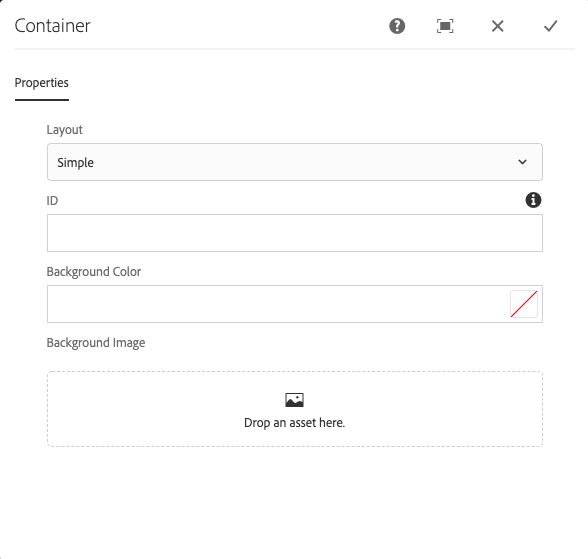

# Container Component{#container-component}

核心组件容器组件允许创建页面上多个其他组件的容器。

## 使用情况 {#usage}

核心组件容器组件允许在页面上为多个其他组件创建容器，并可用于分组其他组件并应用通用样式或布局。

* The container&#39;s properties can be selected in the [configure dialog](#configure-dialog).
* Defaults for the Container Component when adding it to a page can be defined in the [design dialog](#design-dialog).

## Version and Compatibility {#version-and-compatibility}

The Content Component的当前版本是v1，它是在2019年月发行的核心组件中引入的v1，它在本文档中进行了介绍。

下表详细说明了组件的所有支持版本、组件版本的AEM版本以及以前版本的文档链接。

| 组件版本 | AEM 6.3 | AEM 6.4 | AEM 6.5 |
|--- |--- |--- |---|
| v1 | 兼容 | 兼容 | 兼容 |

For more information about Core Component versions and releases, see the document [Core Components Versions](versions.md).

## Sample Component Output {#sample-component-output}

To experience the Container Component as well as see examples of its configuration options as well as HTML and JSON output, visit the [Component Library](http://opensource.adobe.com/aem-core-wcm-components/library/container.html).

## Technical Details {#technical-details}

The latest technical documentation about the Container Component [can be found on GitHub](https://github.com/adobe/aem-core-wcm-components/tree/master/content/src/content/jcr_root/apps/core/wcm/components/container/v1/container).

Further details about developing Core Components can be found in the [Core Components developer documentation](developing.md).

## Configure Dialog {#configure-dialog}

配置对话框允许内容作者定义容器项目，以及它对页面的行为和显示方式。

* **布局** -此选项定义容器组件的行为或布局行为。
   * **简单** -将容器定义为简单的组件集合
   * **响应式网格** -将容器定义为 [AEM响应式网格](https://helpx.adobe.com/experience-manager/6-5/sites/authoring/using/responsive-layout.html)
* **ID** -使用此选项定义要应用于组件的HTML ID属性。
* **背景颜色** -根据配置，可定义为自由格式RGB值 [或使用拾色器](#background-tab)
* **背景图像** -根据配置定义容器 [的背景颜色](#background-tab)

## Design Dialog {#design-dialog}

设计对话框允许模板作者定义使用容器组件的内容作者可用的选项。

### Allowed Components Tab {#allowed-components-tab}

**允许的组件** 选项卡用于定义内容作者可以将哪些组件添加为容器组件的项目。

The Allowed Components tab functions in the same way as the tab of the same name when [defining the policy and properties of a Layout Container in the Template Editor.](https://helpx.adobe.com/experience-manager/6-5/sites/authoring/using/templates.html)

### Default Components Tab {#default-components-tab}

The Default Components tab is used to define which component is added to the component when a particular asset type is dropped on the container, similar to [how default components are defined on the page template](https://helpx.adobe.com/experience-manager/6-5/sites/authoring/using/templates.html#EditingTemplatesTemplateAuthors).

### Responsive Settings Tab {#responsive-settings-tab}

* **列** -定义生成容器网格中的列数。

### Background Tab {#background-tab}

* **背景图像**
   * **启用背景图像** -选择此选项可使内容作者为容器定义背景图像。
* **背景颜色**
   * **启用背景颜色** -选择此选项可使内容作者为容器定义背景颜色。
   * **仅限色板** -选择此选项可仅允许内容作者从预定义的颜色色板中为容器背景颜色进行选择。
      * Only available when **Enable background color** is selected
* **允许的色板** -定义预定义的颜色，内容作者可从中选择容器背景颜色
   * Use the **Add** button to add a pre-defined color swatch. 添加后，条目会添加到列表中，其中包含以下列：
   * **值** -通过RGB值手动定义颜色
      * 点按或单击拾色器可通过调整个别RGB值或定义十六进制值更轻松地选择颜色。
   * **删除** -点按或单击可删除色板。
   * **重新排列** -点按或单击并拖动可重新排列色板的顺序。

### Styles Tab {#styles-tab}

The Container Component supports the AEM [Style System](authoring.md#component-styling).
