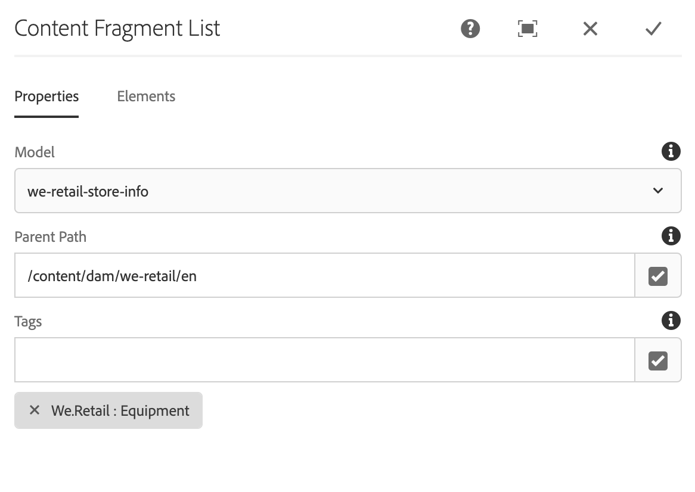
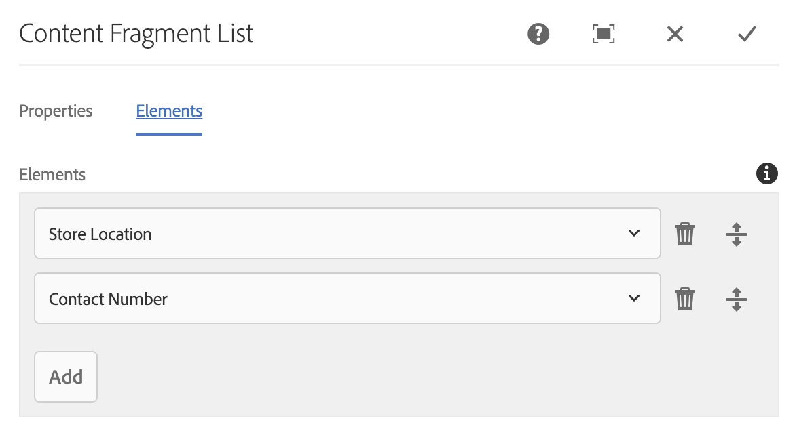

# 内容片段列表组件{#content-fragment-list-component}

核心组件内容片段列表组件允许显示内容片段 [列表](https://helpx.adobe.com/experience-manager/6-5/assets/using/content-fragments.html)。

## 使用情况 {#usage}

核心组件内容片段列表组件允许基于内容片段模型在页 [面中包含内容片段](https://helpx.adobe.com/experience-manager/6-5/assets/using/content-fragments.html) 列表。 这对于创建其他应用程序可 [以轻松使用](https://helpx.adobe.com/experience-manager/6-5/sites/developing/user-guide.html?topic=/experience-manager/6-5/sites/developing/morehelp/headless.ug.js) 、无头内容尤为有用。

* 可以在配置对话框中选择列表及其 [属性](#configure-dialog)。
* 样式可应用于设计对话框中的 [组件](#design-dialog)。

## 版本和兼容性 {#version-and-compatibility}

内容片段组件的当前版本为v1,v1是2019年5月随核心组件版本2.4.0引入的，本文档对此进行了说明。

下表详细列出了组件的所有受支持版本、与组件版本兼容的AEM版本，以及指向先前版本的文档的链接。

| 组件版本 | AEM 6.3 | AEM 6.4 | AEM 6.5 |
|--- |--- |--- |---|
| v1 | 兼容 | 兼容 | 兼容 |

有关核心组件版本和版本的详细信息，请参阅文档核 [心组件版本](versions.md)。

## 示例组件输出 {#sample-component-output}

要体验内容片段列表组件以及查看其配置选项的示例以及HTML和JSON输出，请访问组 [件库](http://opensource.adobe.com/aem-core-wcm-components/library/content-fragment-list.html)。

## 技术详细信息 {#technical-details}

有关内容片段列表组件的最 [新技术文档可在GitHub上找到](https://github.com/adobe/aem-core-wcm-components/blob/master/content/src/content/jcr_root/apps/core/wcm/components/contentfragmentlist/v1/contentfragmentlist)。

有关开发核心组件的更多详细信息，请参阅核 [心组件开发人员文档](developing.md)。

## 配置对话框 {#configure-dialog}

配置对话框允许内容作者定义组成列表的内容片段以及要包括的这些片段的元素。

### 属性选项卡

“属 **性** ”选项卡定义列表中包含的内容片段。 这主要基于选定的内容片段模型，但还有其他可用的筛选选项。

* **模型** -列表所基于的内容片段模型的路径。
   * 默认情况下，定义为“模型路径”的模型的所 **有内容片段** ，都包含在列表中。
* **父路径** -应从中构建列表的父路径。
   * 将根据所选模型路径筛选 **内容片段** ，并将其筛选为指定父路径 **上的片段**。
   * 单击或点按字 **段右侧的** “打开选择对话框”按钮以指定路径。
* **标记** -列表中将仅包含具有指定标记的内容片段。
   * 单击或点按字 **段右侧的** “打开选择对话框”按钮以指定标记。
   * 单击或点按选定标记旁边的X可删除它们。

### Elements选项卡

默认情况下，内容片段模型的所有元素都将包含在列表中。 Elements **允许您** ，仅指定要包含的特定元素。

* **元素** -将仅显示指定列表中内容片段的元素。
   * 单击或点按添 **加按钮** ，以添加新元素
   * 单击或点按删 **除按钮** ，以删除选定元素
   * 拖动 **Order** （顺序）手柄可重新排列元素的顺序。

## 设计对话框 {#design-dialog}

设计对话框允许模板作者定义应用于内容片段列表组件的样式。