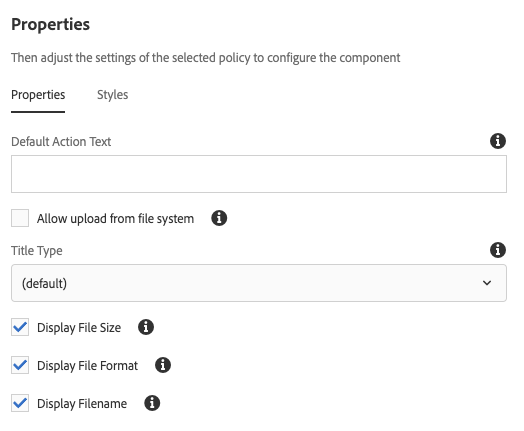

# Download Component{#download-component}

核心组件下载组件允许在页面上创建下载选项。

## 使用情况 {#usage}

核心组件下载组件允许在页面上包含下载选项及其关联的资产。

* The download option&#39;s properties can be selected in the [configure dialog](#configure-dialog).
* Defaults for the download component can be defined in the [design dialog](#design-dialog).

## Version and Compatibility {#version-and-compatibility}

下载组件的当前版本是v1，它是在2019年月发行的核心组件中引入的v1，该版本在文档中进行了介绍。

下表详细说明了组件的所有支持版本、组件版本的AEM版本以及以前版本的文档链接。

| 组件版本 | AEM 6.3 | AEM 6.4 | AEM 6.5 |
|--- |--- |--- |---|
| v1 | 兼容 | 兼容 | 兼容 |

For more information about Core Component versions and releases, see the document [Core Components Versions](versions.md).

## Sample Component Output {#sample-component-output}

To experience the Download Component as well as see examples of its configuration options as well as HTML and JSON output, visit the [Component Library](http://opensource.adobe.com/aem-core-wcm-components/library/download.html).

## Technical Details {#technical-details}

The latest technical documentation about the Download Component [can be found on GitHub](https://github.com/adobe/aem-core-wcm-components/tree/master/content/src/content/jcr_root/apps/core/wcm/components/download/v1/download).

Further details about developing Core Components can be found in the [Core Components developer documentation](developing.md).

## Configure Dialog {#configure-dialog}

配置对话框允许内容作者定义下载项目以及它的行为方式和显示给页面的访客。

### Asset Tab {#asset-tab}

The selection of a download asset is very similar to the functionality of the [Image Component](image.md) and likewise leverages AEM&#39;s DAM.

* **下载资产**
   * Drop an asset from the [asset browser](https://helpx.adobe.com/experience-manager/6-5/sites/authoring/using/author-environment-tools.html) or tap the **browse** option to upload from a local file system.
   * Tap or click **Clear** to de-select the currently selected image.
   * Tap or click **Edit** to [mange the renditions of the asset](https://helpx.adobe.com/experience-manager/6-5/assets/using/managing-assets-touch-ui.html) in the asset editor.

### Properties Tab {#properties-tab}

* **标题** -显示为下载项目的标题
   * **从DAM资产** 获取标题-选择后，标题会自动填充DAM资产的标题。
* **描述** -显示为下载项目的描述性标题
   * **从DAM资产获取说明** -选择后，描述会自动填充DAM资产的描述。
* **操作文本** -显示为下载项目的操作文本
   * 从文件系统上传资产时，需要此字段。
   * **显示内嵌** -选中提供 **的操作文本** 后，将内嵌显示。

## Design Dialog {#design-dialog}

设计对话框允许模板作者定义使用下载组件的内容作者可用的选项。

### Properties Tab {#properties-tab-design}

* **默认操作文本** -定义作者在将下载组件添加到页面时提供的默认 **操作文本** 。
* **允许从文件系统** 上传-允许内容作者从其本地文件系统上传资产作为下载资产。
   * 默认值未选中。
* **标题类型** -用于下载组件标题的HTML元素。
   * 如果未选择任何值，则默认值为H3。
* **显示文件大小** -选择后，资产的文件大小将显示在下载组件中。
   * 将选择默认值。
* **显示文件格式** -选择后，资产的文件格式将显示在下载组件中。
   * 将选择默认值。
* **显示文件名** -选择后，资产的文件名将显示在下载组件中。
   * 将选择默认值。

### Styles Tab {#styles-tab}

The Image Component supports the AEM [Style System](authoring.md#component-styling).
