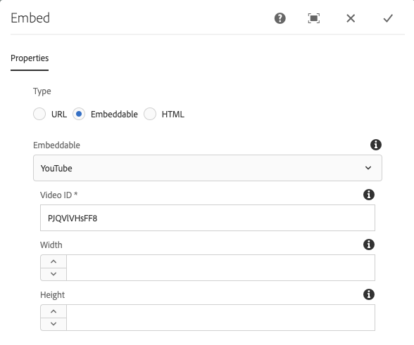

# 嵌入组件{#embed-component}

核心组件嵌入组件允许在AEM内容页面中嵌入外部内容。

## 使用情况 {#usage}

The Core Component Embed Component allows the content author to define selected external content to be embedded within an AEM content page. In addition, there is an option to define free-form HTML to be embedded as well.

* 组件的属性可以在配置对话框中 [定义](#configure-dialog)。
* Defaults for the component when adding it to a page can be defined in the design dialog.

## 版本和兼容性 {#version-and-compatibility}

嵌入组件的当前版本为v1，该版本于2019年9月随核心组件的2.7.0版一起推出，本文档对此进行了说明。

下表详细列出了组件的所有受支持版本、与组件版本兼容的AEM版本，以及指向先前版本的文档的链接。

| 组件版本 | AEM 6.3 | AEM 6.4 | AEM 6.5 |
|--- |--- |--- |---|
| v1 | 兼容 | 兼容 | 兼容 |

有关核心组件版本和版本的详细信息，请参阅文档核 [心组件版本](versions.md)。

## 示例组件输出 {#sample-component-output}

To experience the Embed Component as well as see examples of its configuration options as well as HTML and JSON output, visit the Component Library.

## Technical Details {#technical-details}

有关嵌入组件的最新技术文 [档可在GitHub上找到](https://github.com/adobe/aem-core-wcm-components/tree/master/content/src/content/jcr_root/apps/core/wcm/components/embed/v1/embed)。

有关开发核心组件的更多详细信息，请参阅核 [心组件开发人员文档](developing.md)。

## 配置对话框 {#configure-dialog}

配置对话框允许内容作者定义要嵌入到页面上的外部资源。 首先选择应嵌入的资源类型： **URL**、可 **嵌入****或** HTML。

### URL {#url}

最简单的嵌入方式是URL。 只需粘贴要嵌入到URL字段中的资源的 **URL** 。 组件将尝试访问资源，如果某个处理器可以渲染该资源，则会在 **URL字段下显示确认消息** 。 否则，该字段将被标记为错误。

嵌入组件随附以下类型的资源的处理器：

* 符合Facebook Post、 [Instagram](https://oembed.com/) 、SoundCloud、Twitter和YouTube等oEmbed标准的资源
* Pinterest

开发人员可以按照嵌入组件的开 [发人员文档添加其他URL处理器。](https://github.com/adobe/aem-core-wcm-components/tree/master/content/src/content/jcr_root/apps/core/wcm/components/embed/v1/embed#extending-the-embed-component)

### 可嵌入内容 {#embeddable}

可嵌入式允许对嵌入式资源进行更多自定义，该嵌入式资源可以参数化并包含附加信息。 An author is able to select from pre-configured trusted embeddables and the component ships with a Youtube embeddable out-of-the-box.

“可 **嵌入** ”字段定义要使用的处理器类型。 如果是YouTube可嵌入，您随后可以定义：

* **视频ID** —— 要嵌入的资源的YouTube中的唯一视频ID
* **Width - The width of the embedded video**
* **Height - The height of the embedded video**

Other embeddables would offer similar fields and can be defined by a developer by [following the developer documentation of the Embed Component.](https://github.com/adobe/aem-core-wcm-components/tree/master/content/src/content/jcr_root/apps/core/wcm/components/embed/v1/embed#extending-the-embed-component)

>[!NOTE]
>Embeddables must be enabled at the template level via the [Design Dialog](#design-dialog) to be available to the page author.

### HTML {#html}

You can add free-form HTML to your page using the Embed Component.

>[!NOTE]
>Any unsafe tags such as scripts will be filtered from the entered HTML and will not be rendered on the resulting page.

## 设计对话框 {#design-dialog}

The design dialog allows the template author to define the options available to the content author who uses the Embed Component and the defaults set when placing the Embed Component.

* **Disable URL - Disables the URL option for the content author when selected******
* **Disable Embeddables - Disables the Embeddable option for the content author when selected, regardless of which embeddable processors are allowed.******
* **禁用HTML** —— 在选中时 **为内容作者禁用** HTML选项。
* **允许的可嵌入** -定义内容作者可以使用哪些可嵌入处理器的多选项，前提是“可 **嵌入** ”选项处于活动状态。
