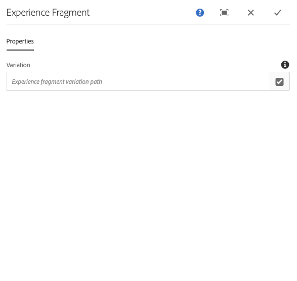

# 体验片段组件{#experience-fragment-component}

核心组件体验片段组件允许内容作者在页面上放置体验片段变体，同时支持本地化的站点结构。

## 使用情况 {#usage}

核心组件体验片段组件允许内容作者从现有体验片段静脉中进行选择，并将其放置在内容页面上。体验片段组件还支持本地化的站点结构。

* 可在 [配置对话框](#configure-dialog)中定义组件的属性。
* 将组件添加到页面时，可以在 [设计对话框中定义该组件的默认值](#design-dialog)。

## 本地化站点结构支持 {#localized-site-structure}

体验片段组件可适应本地化站点结构，并基于页面本地化呈现适当的体验片段。为此，体验片段必须满足以下条件。

* 体验片段组件将添加到模板中。
* 该模板用于创建一个新的内容页面，它是以下本地化结构的一部分 `/content/<site>`。
* 内容页面上引用的体验片段是本地化体验片段结构的一部分，该 `/content/experience-fragments` 结构遵循以下与下一个站点相同的模式， `/content/<site>` 包括使用相同的组件名称。

在这种情况下，与当前页面相同的片段(语言、Blueprint或Live Copy)将作为模板的一部分呈现。

此行为仅限于添加到模板的体验片段组件。体验片段组件添加到单个内容页面的组件将呈现在组件内配置的准确体验片段演绎版。

### 示例 {#example}

比如说，您的内容如下所示：

```
/content
+-- experience-fragments
   \-- we-retail
      +-- language-masters
      +-- us
         +-- en
            +-- footerTextXf
            \-- headerTextXf
         \-- es
            +-- footerTextXf
            \-- headerTextXf
      \-- ch
         +-- de
            +-- footerTextXf
            \-- headerTextXf
         +-- fr
            +-- footerTextXf
            \-- headerTextXf
         \-- it
            +-- footerTextXf
            \-- headerTextXf
+-- we-retail
   +-- language-masters
   +-- us
      +-- en
      \-- es
   +-- ch
      +-- de
      +-- fr
      \-- it
+-- wknd-events
\-- wknd-shop
```

请注意，下面的结构 `/content/experience-fragments/we-retail` 镜像 `/content/we-retail`了结构的结构。

在这种情况下，如果将Experience Fragment组件 `/content/experience-fragments/we-retail/us/en/footerTextXf` 放置在模板上，则基于该模板创建的本地化页面将自动呈现与本地化内容页面对应的本地化体验片段。

因此，如果您导航到使用同一模板的 `/content/we-retail/ch/de` 内容页面，将 `/content/experience-fragments/we-retail/ch/de/footerTextXf` 会显示而不 `/content/experience-fragments/we-retail/us/en/footerTextXf`是显示。

### 回退 {#fallback}

体验片段组件将尝试按以下顺序查找相应的本地化组件。

1. First将尝试寻找语言根目录。
1. 如果找不到，它会尝试找到蓝图。
1. 如果找不到，它会尝试查找Live Copy。
1. 如果找不到，则默认为组件中配置的体验片段。

## 版本和兼容性 {#version-and-compatibility}

体验片段组件的当前版本是v1，它是在2019年月版的核心组件中引入的，它在本文档中进行了介绍。

下表详细说明了组件的所有支持版本、组件版本的AEM版本以及以前版本的文档链接。

| 组件版本 | AEM 6.3 | AEM 6.4 | AEM 6.5 |
|--- |--- |--- |---|
| v1 | 兼容 | 兼容 | 兼容 |

有关核心组件版本和版本的更多信息，请参阅文档 [核心组件版本](versions.md)。

## 示例组件输出 {#sample-component-output}

要体验体验片段组件以及其配置选项的示例以及HTML和JSON输出，请访问 [组件库](http://opensource.adobe.com/aem-core-wcm-components/library/experience-fragment.html)。

## 技术详细信息 {#technical-details}

有关Experience Fragment组件 [的最新技术文档，请参阅GitHub](https://github.com/adobe/aem-core-wcm-components/tree/master/content/src/content/jcr_root/apps/core/wcm/components/experience-fragment/v1/experience-fragment)。

有关开发核心组件的更多详细信息，请参阅 [核心组件开发人员文档](developing.md)。

## 配置对话框 {#configure-dialog}

配置对话框允许内容作者选择应在页面上呈现的体验片段变体。



使用 **打开选择对话框** 按钮打开组件选择器，以选择要添加到内容页面的体验片段组件变量。

如果您将体验片段组件添加到模板，请注意，如果体验片段已本地化，则会自动本地化该组件，因此在页面上渲染的内容可能因您明确选择的组件而异。[请参阅上面](#example) 的示例以了解更多信息。

## 设计对话框 {#design-dialog}

设计对话框允许模板作者定义使用体验片段组件的内容作者可用的选项，以及放置体验片段组件时设置的默认值。


体验片段组件支持AEM [Style System](authoring.md#component-styling)。
