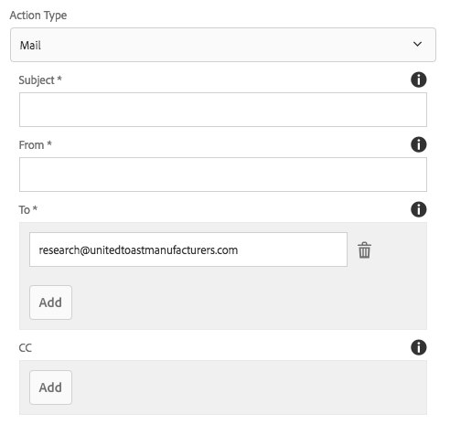
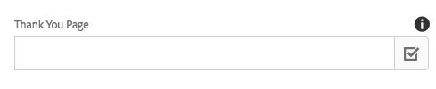

# Form Container Component (v1){#form-container-component-v}

核心组件表单容器组件允许创建简单的提交表单。

## 使用情况 {#usage}

表单容器组件支持简单的WCM表单，并使用嵌套结构允许其他表单组件，从而支持构建简单的信息提交表单和功能。

通过设置对 [话框](form-container-v1.md#main-pars_title) ，内容编辑器可以定义触发操作表单提交的触发器类型、提交内容的存储位置以及是否应触发工作流。 模板作者可以使用设 [计对话框](form-container-v1.md#main-pars_title_1995166862) ，定义允许组件及其映射，这与模板编辑器中标准布局容器 [的设计对话框类似](https://helpx.adobe.com/experience-manager/6-4/sites/authoring/using/templates.html#main-pars_title_1754153843)。

## 版本和兼容性 {#version-and-compatibility}

本文档描述了最初随AEM 6.3的核心组件版本1.0.0引入的表单容器组件的v1。

下表列出了表单容器组件v1的兼容性。

| AEM 版本 | 表单容器组件v1 |
|--- |--- |
| 6.3 | 兼容 |
| 6.4 | 兼容 |

>[!CAUTION]
>
>本文档描述了表单容器组件的v1。
>
>有关表单容器组件当前版本的详细信息，请参阅表 [单容器组件文档](form-container.md) 。

## 设置对话框 {#settings-dialog}

设置对话框允许内容作者定义提交组件时要执行的操作。

根据所选的操 **作类型**，容器中的可用选项将发生更改。 可用的操作类型有：

* [邮件](form-container-v1.md#main-pars_title_966511656)
* [存储内容](form-container-v1.md#main-pars_title_2065985840)
* [提交订单](form-container-v1.md#main-pars_title_686874527)
* [更新订单](form-container-v1.md#main-pars_title_410109286)

无论类型如何，都有 [适用于每个](form-container-v1.md#main-pars_title_375403046) 操作的常规设置。

### 邮件 {#mail}

提交表单后，邮件操作类型将向指定的收件人发送电子邮件。

* **主题** -提交表单时将发送的电子邮件主题
* **发件人** -提交表单时将发送的电子邮件发件人电子邮件地址
* **收件人** -在提交表单后将收到电子邮件的收件人的地址
   * 点按或单击添 **加按钮** ，添加其他地址
   * 点按或单击删 **除按钮** ，以删除电子邮件地址
* **CC** —— 收到提交表单时发送的电子邮件副本的收件人地址
   * 点按或单击添 **加按钮** ，添加其他地址
   * 点按或单击删 **除按钮** ，以删除电子邮件地址

### 存储内容 {#store-content}

提交表单后，表单的内容将存储在指定的存储库位置。

* **内容路径** -存储已提交内容的内容存储库路径
* **查看数据** -点按或单击以JSON形式查看存储的已提交数据
* **启动工作流** -配置为在提交表单时启动将存储的内容作为有效负荷的工作流

### 提交订单 {#submit-order}

提交表单后，将提交订单。

### 更新订单 {#update-order}

提交表单后，订单将更新。

### 常规设置 {#general-settings}

无论选择何种操作类型，都始终可以定义感谢页面。

表单提交完成后，用户将被重定向到指定页面。

* 使用选择对话框在AEM中选择资源。
* 如果感谢页面不在AEM中，请指定绝对URL。 非绝对URL将解释为相对于AEM。
* 留空可在提交后重新显示表单。

## 设计对话框 {#design-dialog}

设计对话框允许模板作者为容器定义允许的组件及其映射，这与模板编辑器中标准布局容器的设 [计对话框类似](https://helpx.adobe.com/experience-manager/6-4/sites/authoring/using/templates.html#main-pars_title_1754153843)。

## 技术详细信息 {#technical-details}

有关表单容器组件的最新技 [术文档可在GitHub上找到](https://github.com/adobe/aem-core-wcm-components/tree/master/content/src/content/jcr_root/apps/core/wcm/components/form/container/v1/container)。

整个核心组件项目可从GitHub下载。

有关开发核心组件的更多详细信息，请参阅核 [心组件开发人员文档](developing.md)。
