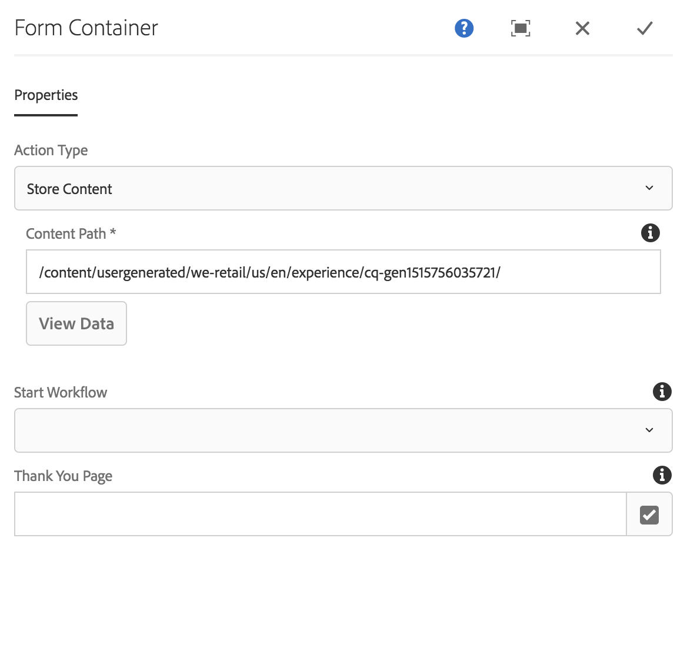
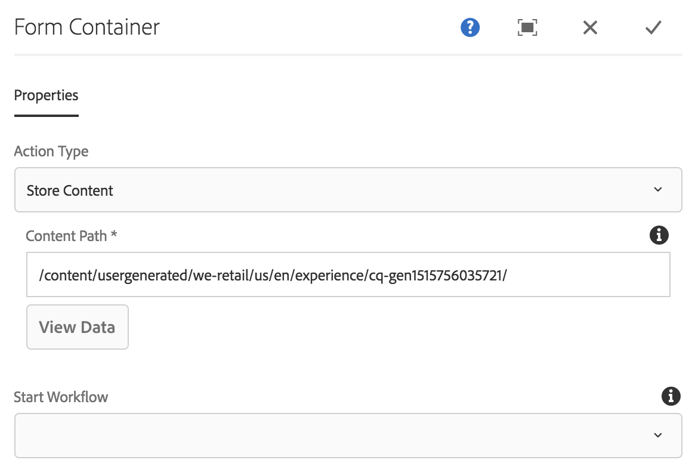

# 表单容器组件{#form-container-component}

核心组件表单容器组件允许创建简单提交表单。

## 使用情况 {#usage}

表单容器组件支持简单的WCM表单并使用嵌套结构允许更多表单组件，从而支持构建简单的信息提交表单和功能。

通过使用 [配置对话框](#configure-dialog) ，内容编辑器可以定义通过表单提交触发的操作、应存储提交内容的位置以及是否应触发工作流。模板作者可以使用 [设计对话框](#design-dialog) 定义允许的组件及其映射，类似于模板编辑器中 [标准布局容器的设计对话框](https://helpx.adobe.com/experience-manager/6-5/sites/authoring/using/templates.html)。

>[!NOTE]
>
>核心组件表单容器组件仅支持使用核心组件表单组件(按钮、文本、隐藏等)。不支持在核心组件表单容器中使用 [基础组件](https://helpx.adobe.com/experience-manager/6-5/sites/authoring/using/default-components-foundation.html) 表单组件(反之亦然)。

## 版本和兼容性 {#version-and-compatibility}

表单容器组件的当前版本是v2，它是在2018年月版的核心组件中引入的，它在文档中进行了介绍。

下表详细说明了组件的所有支持版本、组件版本的AEM版本以及以前版本的文档链接。

| 组件版本 | AEM 6.3 | AEM 6.4 | AEM 6.5 |
|--- |--- |--- |--- |
| v2 | 兼容 | 兼容 | 兼容 |
| [v1](form-container-v1.md) | 兼容 | 兼容 | 兼容 |

有关核心组件版本和版本的更多信息，请参阅文档 [核心组件版本](versions.md)。

## 技术详细信息 {#technical-details}

有关表单容器组件 [的最新技术文档，请参阅GitHub](https://github.com/adobe/aem-core-wcm-components/blob/master/content/src/content/jcr_root/apps/core/wcm/components/form/container/v2/container)。

有关开发核心组件的更多详细信息，请参阅 [核心组件开发人员文档](developing.md)。

## 配置对话框 {#configure-dialog}

配置对话框允许内容作者定义提交组件时采取的操作。

根据所选 **的操作类型**，容器中的可用选项将会更改。可用的操作类型有：

* [邮件](#mail)
* [存储内容](#store-content)
* [提交订单](#submit-order)
* [更新订单](#update-order)

无论类型如何，都有适用于每个操作的 [通用设置](#general-settings) 。

### 邮件 {#mail}

提交表单后，邮件操作类型将发送电子邮件给指定收件人。

* **主题**表单提交时发送的电子邮件主题
* **发件人**：将在表单提交时发送的电子邮件地址
* **收件人**提交表单提交时将收到电子邮件的收件人的地址

   * 点按或单击 **添加** 按钮以添加其他地址
   * 点按或单击 **删除** 按钮以删除电子邮件地址
* **CC将**接收在表单提交时发送的电子邮件的收件人地址的地址
   * 点按或单击 **添加** 按钮以添加其他地址
   * 点按或单击 **删除** 按钮以删除电子邮件地址

### 存储内容 {#store-content}

提交表单后，表单的内容将存储在指定的存储库位置。

* **内容路径**内容存储库路径，其中存储提交的内容
* **查看数据**点按或单击以查看将已提交的提交数据视为JSON
* **启动工作流**配置以在表单提交时将存储的内容作为有效负荷开始工作流

### 提交订单 {#submit-order}

提交表单后，将提交订单。

### 更新订单 {#update-order}

提交表单后，订单将更新。

### 常规设置 {#general-settings}

无论选择了何种操作类型，都可以始终定义感谢页面。

表单提交完成后，用户将被重定向到指定页面。

* 使用选择对话框在AEM中选择一个资源。
* 如果感谢页面未在AEM中，请指定绝对URL。非绝对URL将相对于AEM进行解释。
* 留空可在提交后重新显示表单。

## 设计对话框 {#design-dialog}

设计对话框允许模板作者为容器定义允许的组件及其映射，该容器类似于模板编辑器中 [标准布局容器的设计对话框](https://helpx.adobe.com/experience-manager/6-5/sites/authoring/using/templates.html)。