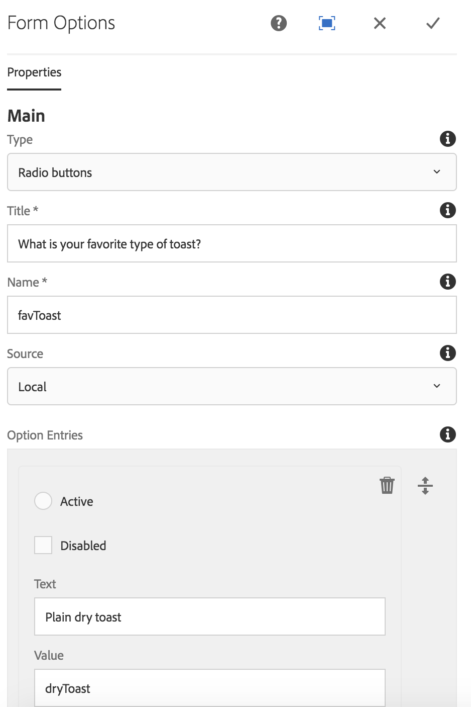

# 表单选项组件{#form-options-component}

核心组件表单选项组件允许从预定义的各种格式的预定义选项中进行选择。

## 使用情况 {#usage}

核心组件表单选项组件允许提交各种不同类型的选项，这些选项以不同的方式呈现，旨在与 [表单容器组件一起使用](form-container.md)。

选项、标签和单个选项的演示文稿可由 [配置对话框中的内容编辑器定义](#configure-dialog)。

## 版本和兼容性 {#version-and-compatibility}

表单选项组件的当前版本是v2，它是在2018年月核心组件的发行版2.0.0中引入的，文档中对此进行了介绍。

下表详细说明了组件的所有支持版本、组件版本的AEM版本以及以前版本的文档链接。

| 组件版本 | AEM 6.3 | AEM 6.4 | AEM 6.5 |
|--- |--- |--- |--- |
| v2 | 兼容 | 兼容 | 兼容 |
| [v1](form-options-v1.md) | 兼容 | 兼容 | 兼容 |

有关核心组件版本和版本的更多信息，请参阅文档 [核心组件版本](versions.md)。

## 示例组件输出 {#sample-component-output}

以下示例取自 [We. Retail](https://helpx.adobe.com/experience-manager/6-5/sites/developing/using/we-retail.html)。

### 屏幕快照 {#screenshot}


### HTML {#html}

```
<form method="POST" action="/content/we-retail/us/en/experience.html" id="new_form" name="new_form" enctype="multipart/form-data" class="cmp-form aem-Grid aem-Grid--12 aem-Grid--default--12">
    <input type="hidden" name=":formstart" value="/content/we-retail/us/en/experience/jcr:content/root/responsivegrid/container">
    
    <div class="hidden aem-GridColumn aem-GridColumn--default--12">
<input type="hidden" id="form-hidden-66464844" name="hidden">

</div>
<div class="hidden aem-GridColumn aem-GridColumn--default--12">
<input type="hidden" id="form-hidden-858231075" name="hidden">

</div>
<div class="hidden aem-GridColumn aem-GridColumn--default--12">
<input type="hidden" id="form-hidden-862566768" name="hidden">

</div>
<div class="container responsivegrid aem-GridColumn aem-GridColumn--default--12">

    <input type="hidden" name=":formstart" value="/content/we-retail/us/en/experience/jcr:content/root/responsivegrid/container/container">
    
    <div class="options aem-GridColumn aem-GridColumn--default--12">

    <fieldset class="cmp-form-options">
        
            <legend class="cmp-form-options__legend">What is your favorite type of toast?</legend>
            <label class="cmp-form-options__field-label">
                <input class="cmp-form-options__field cmp-form-options__field--radio" type="radio" name="favToast" value="dryToast">
                Plain dry toast
            </label>
<label class="cmp-form-options__field-label">
                <input class="cmp-form-options__field cmp-form-options__field--radio" type="radio" name="favToast" value="frenchToast">
                French Toast
            </label>
<label class="cmp-form-options__field-label">
                <input class="cmp-form-options__field cmp-form-options__field--radio" type="radio" name="favToast" value="texasToast">
                Texas Toast
            </label>

    </fieldset>

</div>

</div></form>
```

### JSON {#json}

```
"container":{  
                           "columnClassNames":"aem-GridColumn aem-GridColumn--default--12",
                           "columnCount":12,
                           "gridClassNames":"aem-Grid aem-Grid--12 aem-Grid--default--12",
                           ":items":{  
                              "options_816658469":{  
                                 "columnClassNames":"aem-GridColumn aem-GridColumn--default--12",
                                 "id":"form-options-269951232",
                                 "title":"What is your favorite type of toast?",
                                 "name":"favToast",
                                 "type":"RADIO",
                                 "items":[  
                                    {  
                                       "value":"dryToast",
                                       "text":"Plain dry toast",
                                       "selected":false,
                                       "disabled":false
                                    },
                                    {  
                                       "value":"frenchToast",
                                       "text":"French Toast",
                                       "selected":false,
                                       "disabled":false
                                    },
                                    {  
                                       "value":"texasToast",
                                       "text":"Texas Toast",
                                       "selected":false,
                                       "disabled":false
                                    }
                                 ],
                                 ":type":"core/wcm/sandbox/components/form/options/v2/options"
                              }
                           },
                           ":itemsOrder":[  
                              "options_816658469"
                           ],
                           ":type":"core/wcm/sandbox/components/form/container/v2/container"
                        }
```

### 技术详细信息 {#technical-details}

有关表单选项组件 [的最新技术文档可在GitHub](https://github.com/adobe/aem-core-wcm-components/blob/master/content/src/content/jcr_root/apps/core/wcm/components/form/options/v2/options)上找到。

有关开发核心组件的更多详细信息，请参阅 [核心组件开发人员文档](developing.md)。

## 配置对话框 {#configure-dialog}

配置对话框允许内容作者定义应显示的选项类型、标签和可用选项。



* **类型** -将如何呈现选项
   * **复选框**
   * **单选按钮**
   * **下拉面板**
   * **多选下拉面板**
* **标题**将作为选项的标签显示的标题
* **名称**用表单数据提交的字段名称
* **源**位置定义选项的位置
   * **在组件内定义本地**定义
      * 点按或单击 **添加** 按钮以添加值， **删除可** 删除值
      * **值**提交表单时选择该选项时保存的值
      * **文本**表单上显示的选项的标签
      * **活动**在表单加载时，选项被标记为选定
      * **禁用**选项不可选择，但仍显示
      * **列表** AEM中定义的静态列表用于选项
         * **列出** AEM中静态列表的路径
            * 使用“浏览”按钮查找列表资源
      * **数据源**用于选项的数据源
         * **数据源的数据源**资源类型
* **帮助消息**为用户提供在字段中输入内容的提示

## 设计对话框 {#design-dialog}

### 样式选项卡 {#styles-tab}

表单选项组件支持AEM [Style System](authoring.md#component-styling)。