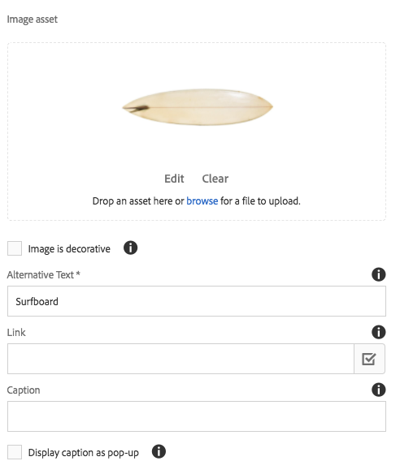

# 图像组件(v1){#image-component-v}

核心组件图像组件是自适应图像组件，用于就地编辑。

## 使用情况 {#usage}

图像组件可轻松放置图像资源并提供就地编辑功能。它包含延迟加载以及内容作者裁剪的自适应图像选择。

设计对话框中的模板作者可以定义允许的图像宽度以及裁剪和其他 [设置](image-v1.md#main-pars_title_1995166862)。内容编辑器可以在 [配置对话框](image-v1.md#main-pars_title_55926120) 中上传或选择资产，并在 [编辑对话框中裁剪图像](image-v1.md#main-pars_title)。为了方便起见，还提供了简单的就地修改图像。

## 版本和兼容性 {#version-and-compatibility}

本文档描述了图像组件的v1，该组件最初随AEM6.3的核心组件版本1.0.0一起引入。

下表列出了图像组件的v1的兼容性。

| AEM 版本 | 图像组件v1 |
|--- |--- |
| 6.3 | 兼容 |
| 6.4 | 兼容 |

>[!CAUTION]
>
>本文档描述了图像组件的v1。
>
>有关图像组件的当前版本的详细信息，请参阅 [图像组件](image.md) 文档。

## 示例组件输出 {#sample-component-output}

以下示例取自 [We. Retail](https://helpx.adobe.com/experience-manager/6-4/sites/developing/using/we-retail.html)。

### 屏幕快照 {#screenshot}


### HTML {#html}

```
<div class="cmp cmp-image aem-GridColumn aem-GridColumn--default--12">
 
        <noscript data-cmp-image="{&#34;smartImages&#34;:[],&#34;smartSizes&#34;:[],&#34;lazyEnabled&#34;:true}">
            
        </noscript>

</div>
```

### JSON {#json}

```
"image": {
              "columnClassNames": "aem-GridColumn aem-GridColumn--default--12",
              "smartSizes": [],
              "smartImages": [],
              "lazyEnabled": true,
              "src": "/content/we-retail/us/en/equipment/equipment/jcr%3acontent/root/responsivegrid/image.img.jpeg",
              ":type": "weretail/components/content/image"
            }
```

>[!NOTE]
>
>核心组件中的JSON导出需要核心组件版本1.1.0。有关更多信息，请参见核心组件v [](versions.md#main-pars_title_236368006) 的兼容性信息。

## 配置对话框 {#configure-dialog}

除了标准 [编辑对话框](image-v1.md#main-pars_title) 和 [设计对话框](image-v1.md#main-pars_title_1995166862)外，图像组件还提供了一个配置对话框，其中定义了图像本身及其描述和基本属性。



* **图像资产**
   * 从 [资产浏览器中拖放资产](https://helpx.adobe.com/experience-manager/6-3/sites/authoring/using/author-environment-tools.html#main-pars_title) 或点击 **浏览** 选项以从本地文件系统上传。
   * 点按或单击 **清除** 可取消选择当前选定的图像。
   * 点按或单击 **编辑** 可 [在资产编辑器](https://helpx.adobe.com/experience-manager/6-3/assets/using/managing-assets-touch-ui.html#main-pars_title_19) 中合并资产的演绎版。

* **图像是装饰性** 的-检查是否应通过辅助技术忽略图像，因此不需要替代文本。这仅适用于装饰图像。
* **替换文本** -图像的意义或功能的文本替换，对于视觉障碍的读者。
* **链接**
   * 将图像链接到其他资源。
   * 使用选择对话框链接到其他AEM资源。
   * 如果不链接到AEM资源，请输入绝对URL。非解决的URL将解释为相对于AEM的URL。

* **题注** -有关图像的其他信息，在图像下方显示。
* **显示题注作为弹出** 窗口-选中后，题注不会显示在图像下方，但作为鼠标悬停在图像上方时显示的弹出窗口。

## 编辑对话框 {#edit-dialog}

编辑对话框允许内容作者裁切、修改启动图和缩放图像。


* 开始裁剪

   

   选择此选项将打开预定义裁剪比例的下拉列表。

   * 选择“ **Free Hand** ”选项可定义您自己的裁剪。
   * 选择 **“删除裁剪** ”选项可显示原始资产。
   选择裁剪选项后，使用蓝色手柄在图像上调整裁剪大小。

   

* 向右旋转

   

   使用此选项可将图像旋转90°(顺时针)。

* 启动地图

   

   使用此选项可将启动项映射应用于图像。选择此选项将打开一个新窗口，允许用户选择地图的形状：

   * **添加矩形图**
   * **添加圆形映射**
   * **添加多边形映射**

      * 默认情况下，添加三角形映射。双击形状线，在新一侧添加新的蓝色调整大小手柄。
   选择地图形状后，它会叠加在图像上，从而允许调整大小。拖放蓝色大小手柄可调整形状。

   

   在调整启动地图的大小之后，单击它以打开一个浮动工具栏以定义链接的路径。

   * **路径**
      * 使用路径选取器选项在AEM中选择路径
      * 如果路径不在AEM中，请使用绝对URL。将根据AEM解释非绝对路径。

      * **替代文本**路径目标的替换说明
      * **目标**
         * **相同选项卡**
         * **新选项卡**
         * **父框架**
         * **顶层框架**
   点按或单击蓝色选中标记以保存、黑色x取消，以及红色垃圾桶可删除映射。

   

* 重置缩放

   

   如果图像已缩放，则使用此选项重置缩放级别。

* 打开缩放滑块

   

   使用此选项可显示控制图像缩放级别的滑块。

   

就地编辑器还可用于修改图像。由于空间限制，只有基本选项可用。要获得完整的编辑选项，请使用全屏模式。


>[!NOTE]
>
>GIF图像不支持图像编辑操作(裁剪、翻转、旋转)。在编辑模式下进行的任何此类更改都不会被保留。

## 设计对话框 {#design-dialog}

设计对话框允许模板作者定义在使用此组件时内容作者的裁剪、上传和旋转上传。

### 主要 {#main}

**在主** 选项卡上，您可以为图像定义允许的宽度列表，以从列表中自动加载最合适的宽度。


点按或单击添加按钮以添加其他大小。

* 使用抓取手柄重新排列大小的顺序。
* 使用删除图标删除宽度。

默认情况下，加载图像时会推迟加载图像。选择“ **停用延迟加载** ”可在载入页面时加载图像。

### 功能 {#features}

在 **“功能** ”选项卡上，您可以定义内容作者在使用组件时可使用的选项，包括上传选项、方向和裁剪选项。

* 源

   

   选择 **“允许从文件系统上传资产”以** 允许内容作者从其本地计算机上传图像。要强制内容作者只从AEM中选择资产，请取消选中此选项。

* 方向

   

   * **旋转** -使用此选项可允许内容作者使用 **“Roogle Right** ”选项。
   * **翻转**使用此选项可允许内容作者使用“水平 **翻转”** 和“垂直 **翻转** ”选项。
   >[!CAUTION]
   >
   >**默认** 情况下禁用“翻转”选项。启用该选项将在图像组件的编辑对话框中显示“垂直 **** 翻转”和 **** “水平翻转”按钮，但是，AEM当前不支持该功能，而使用这些选项所做的任何更改将不会被保留。

<!-- 
Comment Type: remark
Last Modified By: Chris Bohnert (bohnert)
Last Modified Date: 2017-11-20T05:51:34.378-0500

<p>Added caution based on CQDOC-11457. Hid the flip options in the procedure using the <strong>Draft</strong> option so that when this feature is implemented in CQ-4221539, the <strong>Draft</strong> property can simply be removed along with the caution.</p>
-->

* 裁剪

   

   选择 **“允许裁剪** ”选项，以允许内容作者在编辑对话框中的组件中裁剪图像。
   * 单击 **添加** 以添加预定义的裁剪长宽比。
   * 输入一个描述性名称，该名称将显示在 **“开始裁剪”** 下拉菜单中。
   * 输入长宽比的数值。
   * 使用拖动手柄重新排列长宽比的顺序
   * 使用垃圾桶图标可删除长宽比。
   >[!CAUTION]
   >
   >请注意，在AEM中，裁剪长宽比定义为 **高度/宽度**。这与传统的宽度/高度定义不同，并且出于传统兼容性原因而完成。只要您提供了一个清晰的比率名称，内容作者就不会注意到任何区别，因为该名称的名称是在UI中显示，而不是由比例本身显示。

## 技术详细信息 {#technical-details}

有关图像组件 [的最新技术文档可在GitHub](https://github.com/adobe/aem-core-wcm-components/tree/master/content/src/content/jcr_root/apps/core/wcm/components/image/v1/image)上找到。

可以从GitHub下载整个核心组件项目。

有关开发核心组件的更多详细信息，请参阅 [核心组件开发人员文档](developing.md)。
