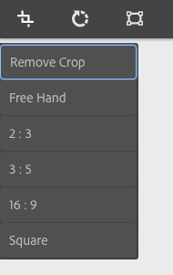
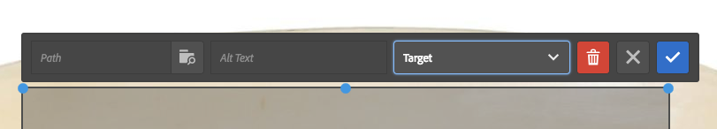
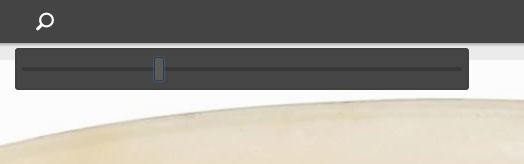
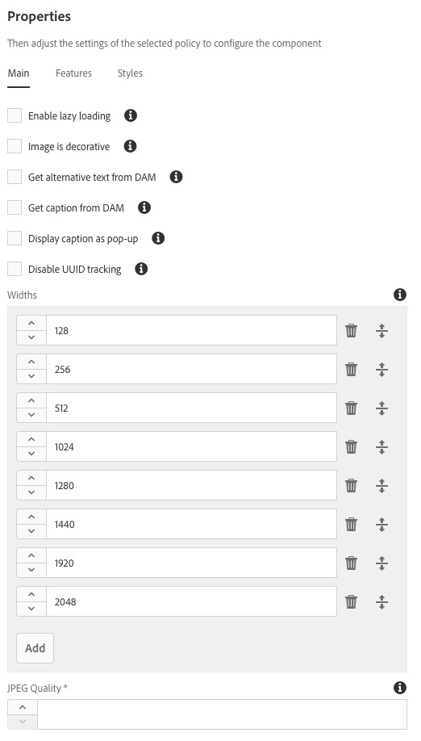

# 图像组件{#image-component}

核心组件图像组件是具有就地编辑功能的自适应图像组件。

## 使用情况 {#usage}

图像组件可轻松放置图像资源并提供就地编辑功能。它包含延迟加载以及内容作者裁剪的自适应图像选择。

The image widths as well as cropping and additional settings can be defined by the template author in the [design dialog](#design-dialog). The content editor can upload or select assets in the [configure dialog](#configure-dialog) and crop the image in the [edit dialog](#edit-dialog). 为了方便起见，还提供了简单的就地修改图像。

## Version and Compatibility {#version-and-compatibility}

图像组件的当前版本是v2，它是在2018年月版的核心组件中引入的，它在文档中进行了介绍。

下表详细说明了组件的所有支持版本、组件版本的AEM版本以及以前版本的文档链接。

| 组件版本 | AEM 6.3 | AEM 6.4 | AEM 6.5 |
|--- |--- |--- |--- |
| v2 | 兼容 | 兼容 | 兼容 |
| [v1](image-v1.md) | 兼容 | 兼容 | 兼容 |

For more information about Core Component versions and releases, see the document [Core Components Versions](versions.md).

## SVG Support {#svg-support}

可缩放矢量图形(SVG)由图像组件支持。

* 支持从DAM拖放SVG资源并从本地文件系统上传SVG文件。
* 自适应图像Servlet流流播放原始SVG文件(跳过转换)。
* 对于SVG图像，“智能图像”和“智能大小”设置为图像模型中的空数组。

### 安全 {#security}

由于安全原因，图像编辑器从不直接调用原始SVG。It is called through ``. 因此，浏览器可防止嵌入到SVG文件中的脚本执行。

>[!CAUTION]
>
>SVG support requires release 2.1.0 of the Core Components or higher along with [service pack 2](https://helpx.adobe.com/experience-manager/6-4/release-notes/sp-release-notes.html) for AEM 6.4 or [service pack 3](https://helpx.adobe.com/experience-manager/6-3/release-notes/sp3-release-notes.html) for AEM 6.3 or higher to support [new image editor features](https://helpx.adobe.com/experience-manager/6-4/sites/developing/using/image-editor.html) within AEM.

## Sample Component Output {#sample-component-output}

To experience the Image Component as well as see examples of its configuration options as well as HTML and JSON output, visit the [Component Library](http://opensource.adobe.com/aem-core-wcm-components/library/image.html).

### Technical Details {#technical-details}

The latest technical documentation about the Image Component [can be found on GitHub](https://github.com/adobe/aem-core-wcm-components/blob/master/content/src/content/jcr_root/apps/core/wcm/components/image/v2/image).

Further details about developing Core Components can be found in the [Core Components developer documentation](developing.md).

>[!NOTE]
>
>As of Core Components release 2.1.0, the Image Component supports [schema.org microdata](https://schema.org).

## Configure Dialog {#configure-dialog}

In addition to the standard [edit dialog](#edit-dialog) and [design dialog](#design-dialog), the image component offers a configure dialog where the image itself is defined along with its description and basic properties.

### Asset Tab {#asset-tab}

* **图像资产**
   * Drop an asset from the [asset browser](https://helpx.adobe.com/experience-manager/6-5/sites/authoring/using/author-environment-tools.html) or tap the **browse** option to upload from a local file system.
   * Tap or click **Clear** to de-select the currently selected image.
   * Tap or click **Edit** to [mange the renditions of the asset](https://helpx.adobe.com/experience-manager/6-5/assets/using/managing-assets-touch-ui.html) in the asset editor.

### Metadata Tab {#metadata-tab}

* **图像为装饰性** 检查是否应通过辅助技术忽略图像，因此不需要替代文本。这仅适用于装饰图像。
* **为视觉障碍的读者提供的替代文本** 的替代文本或功能的替代文本。
   * Get alternative text from DAM - When checked the image&#39;s alternative text will be populated with the value of the `dc:description` metadata in DAM.

* **题注** 有关图像的其他信息，默认情况下显示在图像下方。
   * **从DAM** 中获取题注时，图像的题注文本将填充DAM `dc:title` 中元数据的值。
   * **显示题注作为弹出** 窗口在选中时，题注不会显示在图像下方，但作为鼠标悬停在图像上方时显示的弹出窗口。

* **链接**
   * 将图像链接到其他资源。
   * 使用选择对话框链接到其他AEM资源。
   * 如果不链接到AEM资源，请输入绝对URL。非解决的URL将解释为相对于AEM的URL。

## Edit Dialog {#edit-dialog}

编辑对话框允许内容作者裁切、修改启动图和缩放图像。

* 开始裁剪

   

   选择此选项将打开预定义裁剪比例的下拉列表。

   * Choose the option **Free Hand** to define your own crop.
   * Choose the option **Remove Crop** to display the original asset.
   选择裁剪选项后，使用蓝色手柄在图像上调整裁剪大小。

   

* 向右旋转

   

   使用此选项可将图像旋转90°(顺时针)。

* 水平翻转

   

   使用此选项可水平翻转图像或沿y轴将图像枢绕180°。

* 垂直翻转

   

   使用此选项可垂直翻转图像或沿x轴将图像枢绕180°。

* 启动地图

   >[!CAUTION]
   >
   >The Launch Map feature requires release 2.1.0 of the Core Components or higher along with [service pack 2](https://helpx.adobe.com/experience-manager/6-4/release-notes/sp-release-notes.html) for AEM 6.4 or [service pack 3](https://helpx.adobe.com/experience-manager/6-3/release-notes/sp3-release-notes.html) for AEM 6.3 or higher to support [new image editor features](https://helpx.adobe.com/experience-manager/6-4/sites/developing/using/image-editor.html) within AEM.

   

   使用此选项可将启动项映射应用于图像。选择此选项将打开一个新窗口，允许用户选择地图的形状：

   * **添加矩形图**
   * **添加圆形映射**
   * **添加多边形映射**
      * 默认情况下，添加三角形映射。双击形状线，在新一侧添加新的蓝色调整大小手柄。
   选择地图形状后，它会叠加在图像上，从而允许调整大小。拖放蓝色大小手柄可调整形状。

   

   在调整启动地图的大小之后，单击它以打开一个浮动工具栏以定义链接的路径。

   * **路径**
      * 使用路径选取器选项在AEM中选择路径
      * 如果路径不在AEM中，请使用绝对URL。将根据AEM解释非绝对路径。
   * **替代文本** 路径目标的替换说明
   * **目标**
      * **相同选项卡**
      * **新选项卡**
      * **父框架**
      * **顶层框架**
   点按或单击蓝色选中标记以保存、黑色x取消，以及红色垃圾桶可删除映射。

   

* 重置缩放

   

   如果图像已缩放，则使用此选项重置缩放级别。

* 打开缩放滑块

   

   使用此选项可显示控制图像缩放级别的滑块。

   

就地编辑器还可用于修改图像。由于空间限制，只有基本选项可用。要获得完整的编辑选项，请使用全屏模式。

>[!NOTE]
>
>GIF图像不支持图像编辑操作(裁剪、翻转、旋转)。在编辑模式下进行的任何此类更改都不会被保留。

## Design Dialog {#design-dialog}

设计对话框允许模板作者定义使用此组件时内容作者的裁剪、上传和旋转以及上传选项。

### Main Tab {#main-tab}

**在主** 选项卡上，您可以为图像定义宽度列表以自动从列表中加载最合适的宽度。

此外，您还可以定义作者将组件添加到页面时自动或禁用的常规组件选项。

* **启用延迟加载** 定义在将图像组件添加到页面时是否自动启用延迟加载选项。
* **图像为装饰** 定义在将图像组件添加到页面时，是否自动启用装饰图像选项。
* **从DAM** 定义替换文本，在将图像组件添加到页面时，是否会自动启用从DAM中检索替代文本的选项。
* **从DAM** 定义题注，定义在将图像组件添加到页面时是否自动启用从DAM检索题注的选项。
* **显示题注作为弹出** 式定义是否在将图像组件添加到页面时自动启用图像题注作为弹出窗口的选项。
* **禁用UUID跟踪** 检查以停用图像资产的UUID跟踪。

* **宽度** 为图像定义宽度列表以使图像从列表自动加载最合适的宽度。
   * Tap or click the **Add** button to add another size.
      * 使用抓取手柄重新排列大小的顺序。
      * Use the **Delete** icon to remove a width.
   * 默认情况下，加载图像时会延迟加载图像。
      * Select the option **Disable lazy loading** to load the images upon page load.
* **JPEG质量**转换的(例如，缩放或裁剪)
JPEG图像的质量因子(以百分比和100表示)。

>[!CAUTION]
>
>“JPEG质量”选项从核心组件的2.2.0版本中可用。

>[!NOTE]
>
>As of release 2.2.0 of the Core Components, the Image Component adds the unique UUID attribute `data-asset-id` to the image asset to allow tracking and analysis of the number of views that individual assets receive.

### Features Tab {#features-tab}

On the **Features** tab you can define which options are available to the content authors when using the component including upload options, orientation, and cropping options.

* 源

   

   Select the option **Allow asset upload from file system** to allow content authors to upload images from his or her local computer. 要强制内容作者只从AEM中选择资产，请取消选中此选项。

* 方向

   

* **旋转** 使用此选项允许内容作者使用 **“Roogle
Right** ”选项。
* **翻转** 使用此选项可允许内容作者使用“水平 **翻转”** 和“垂直 **翻转** ”选项。

   >[!CAUTION]
   >
   >**默认** 情况下禁用“翻转”选项。Enabling it will display the **Flip Vertically** and **Flip Horizontally** buttons in the edit dialog of the image component, however the feature is not currently supported by AEM and any changes made using these options will not be persisted.

<!-- 
Comment Type: remark
Last Modified By: Chris Bohnert (bohnert)
Last Modified Date: 2017-11-20T05:51:34.378-0500

Added caution based on CQDOC-11457. Hid the flip options in the procedure using the <strong>Draft</strong> option so that when this feature is implemented in CQ-4221539, the <strong>Draft</strong> property can simply be removed along with the caution.

 -->

* 裁剪

   

   Select the option **Allow crop** to allow the content author to crop the image in the component in the edit dialog.
   * Click **Add** to add a pre-defined crop aspect ratio.
   * Enter a descriptive name, which will be shown in the **Start Crop** dropdown.
   * 输入长宽比的数值。
   * 使用拖动手柄重新排列长宽比的顺序
   * 使用垃圾桶图标可删除长宽比。
   >[!CAUTION]
   >
   >Note that in AEM, crop aspect ratios are defined as **height/width**. 这与传统的宽度/高度定义不同，并且出于传统兼容性原因而完成。只要您提供了一个清晰的比率名称，内容作者就不会注意到任何区别，因为该名称的名称是在UI中显示，而不是由比例本身显示。

### Styles Tab {#styles-tab-1}

The Image Component supports the AEM [Style System](authoring.md#component-styling).