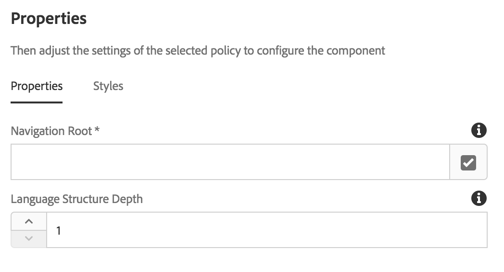
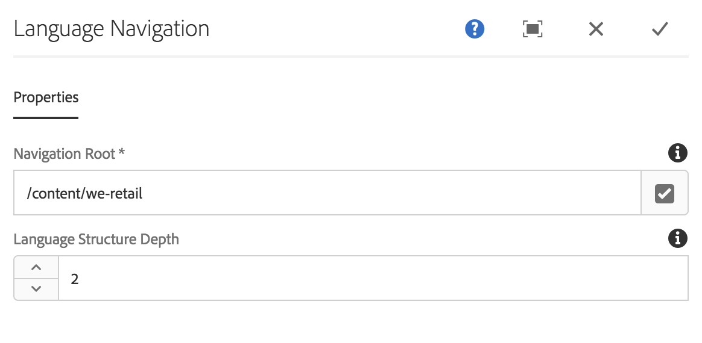

# Language Navigation Component{#language-navigation-component}

语言导航组件提供站点的语言/国家/地区导航，以便访客能够在不同区域设置导航到同一页面。

## 使用情况 {#usage}

网站通常以多种语言提供给不同地区。语言导航组件允许访客以不同语言/区域设置查看同一页面。因此，如果您是瑞士德语版本的读者，您可以轻松切换到同一页面的美国英语版本。语言导航组件处理站点语言结构并自动查找相应的页面。

[编辑对话框](#edit-dialog) 允许全局站点导航根目录的定义以及导航应转到的结构。使用 [设计对话框](#design-dialog)，模板作者可以设置相同选项的默认值。

## 版本和兼容性 {#version-and-compatibility}

语言导航组件的当前版本是v1，它是在2018年月核心组件发行版中引入的，它在本文档中进行了介绍。

下表详细说明了组件的所有支持版本、组件版本的AEM版本以及以前版本的文档链接。

| 组件版本 | AEM 6.3 | AEM 6.4 | AEM 6.5 |
|--- |--- |--- |--- |
| v1 | 兼容 | 兼容 | 兼容 |

有关核心组件版本和版本的更多信息，请参阅文档 [核心组件版本](versions.md)。

## 示例组件输出 {#sample-component-output}

要体验语言导航组件以及查看其配置选项的示例以及HTML和JSON输出，请访问 [组件库](http://opensource.adobe.com/aem-core-wcm-components/library/language-navigation/language-structure/us/en/language-navigation.html)。

## 技术详细信息 {#technical-details}

有关语言导航组件 [的最新技术文档，请参阅GitHub](https://github.com/adobe/aem-core-wcm-components/blob/master/content/src/content/jcr_root/apps/core/wcm/components/languagenavigation/v1/languagenavigation)。

有关开发核心组件的更多详细信息，请参阅 [核心组件开发人员文档](developing.md)。

## 设计对话框 {#design-dialog}

编辑对话框允许全局站点导航根目录的定义以及导航应转到的结构。

通常，这些配置只需要在页面模板中完成。但是，可以通过 [编辑对话框在页面级别更改它们](#edit-dialog)。

### 属性选项卡 {#properties-tab}



* **导航根目录**
   * 这就是站点的语言导航应开始的位置。
   * 站点的语言结构从此根下的下一个级别开始。
* **语言结构深度**
   * 这是 **导航根下的内容树级别的级别** 表示站点的语言结构。示例:
      * `1` 通常意味着您只能选择语言。
      * `2` 这意味着您可以选择语言和国家/地区。
      * `3` 通常意味着您可以选择语言、国家和地区。

#### 示例 {#example}

比如说，您的内容如下所示：

```
/content
+-- we-retail
   +-- language-masters
   +-- us
      +-- en
      \-- es
   \-- ch
      +-- de
      +-- fr
      \-- it
+-- wknd-events
\-- wknd-shop
```

对于站点We. Retail，您很可能希望将页面模板上的语言导航组件作为标题的一部分进行放置。在模板的一部分中，您可以设置组件 **的导航根** ， `/content/we-retail` 因为该站点是站点的本地化内容开始的位置。您还需要设置 **语言结构深度**`2` ，因为您的结构有两个级别(随后的国家/地区为人口老龄化)。

对于 **导航根** 值，语言组件会知道导航 `/content/we-retail` 开始后，它可以生成语言导航选项，方法是识别内容树中的下两个级别，即站点的语言导航结构(由 **语言结构深度** 值定义)。

无论用户查看的页面如何，语言导航组件都可以通过了解当前页面的位置并向后工作到根目录来查找相应页面，然后转发到相应的页面。

### 样式选项卡 {#styles-tab}

语言导航组件支持AEM [Style System](authoring.md#component-styling)。

## Edit Dialog {#edit-dialog}

通常只需在站点的页面模板上添加和配置Langoge导航组件。但是，如果需要将语言导航组件添加到单个内容页面，编辑对话框允许内容作者配置与 [设计对话框中所述的相同值](#design-dialog)。


