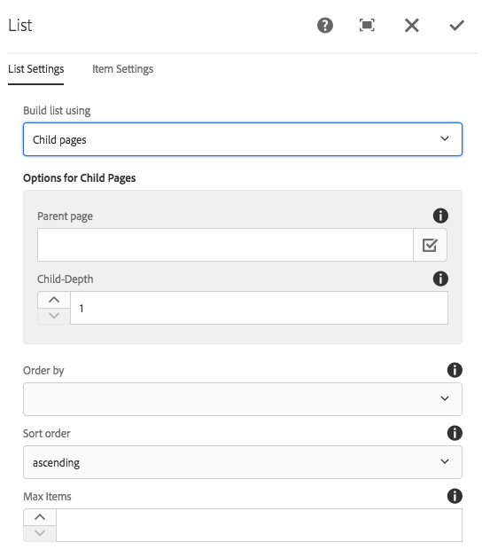
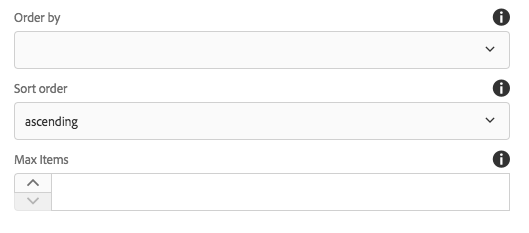
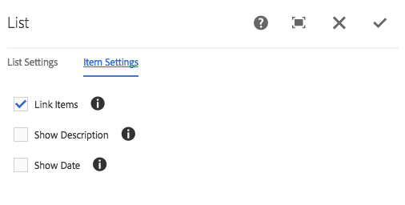
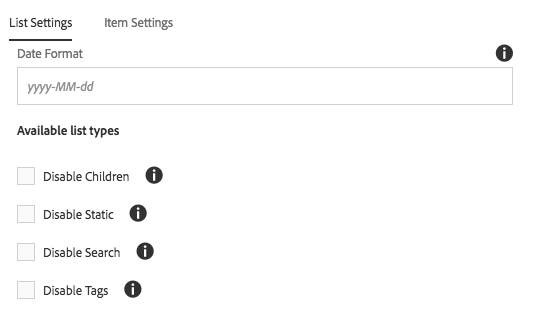

# 列表组件{#list-component}

核心组件列表组件允许轻松创建动态和静态列表。

## 使用情况 {#usage}

列表组件可用于创建子页面的动态列表或任意定义项目的静态列表。 可用列表类型和格式选项可由模板作者在设计对话框中定 [义](#design-dialog)。 内容编辑器可以从可用的列表类型中进行选择，以及如何在编辑对话框中设置列 [表元素格式](#edit-dialog)。

## 版本和兼容性 {#version-and-compatibility}

列表组件的当前版本为v2，该版本在2018年1月随核心组件的2.0.0版一起推出，本文档对此进行了说明。

下表详细列出了组件的所有受支持版本、与组件版本兼容的AEM版本，以及指向先前版本的文档的链接。

| 组件版本 | AEM 6.3 | AEM 6.4 | AEM 6.5 | AEM作为云服务 |
|--- |--- |--- |--- |---|
| v2 | 兼容 | 兼容 | 兼容 | 兼容 |
| [v1](list-v1.md) | 兼容 | 兼容 | 兼容 | - |

有关核心组件版本和版本的详细信息，请参阅文档核 [心组件版本](versions.md)。

## 示例组件输出 {#sample-component-output}

要体验列表组件及其配置选项的示例以及HTML和JSON输出，请访问组件 [库](https://adobe.com/go/aem_cmp_library_list)。

### 技术详细信息 {#technical-details}

有关列表组件的最新技术文 [档可在GitHub上找到](https://adobe.com/go/aem_cmp_tech_list_v2)。

有关开发核心组件的更多详细信息，请参阅核 [心组件开发人员文档](developing.md)。

## Edit Dialog {#edit-dialog}

编辑对话框允许内容作者配置列表和列表项。

### 列表设置选项卡 {#list-settings-tab}

列表可以采用不同的方式构建。

* [子页面](#child-pages)
* [固定列表](#fixed-list)
* [搜索](#search-options)
* [标记](#tags)

无论如何构建列表，都有 [可以始终配置的排序选项](#sort-options) 。

根据内容作者选择如何构建列表，其他配置选项将会更改。

#### 子页面 {#child-pages}

列表可以由当前页面或其他页面的子页面构建。

* **父页面**
   * 其子页面应该列出的页面
   * 留空以使用当前页面

* **子级深度**&#x200B;层次结构中应使用多少个级别

#### Fixed List {#fixed-list}

可以使用项目的固定列表生成列表。

点按或单击 **添加** 按钮，将新项目插入列表。

* 在列表中输入项目文本，或使用“选择 **对话框** ”从AEM中选择项目。
* 使用拖动手柄重新排列列表中的项目。
* 使用垃圾桶图标可删除列表中的项目。

#### 搜索 {#search-options}

可以使用AEM内容搜索结果生成列表。

* **搜索查**&#x200B;询要运行全文搜索以生成列表元素的字符串
* **搜索**&#x200B;应在何处运行搜索
   * 使用“ **选择”对话框** ，在AEM中选择位置
   * 如果留空，则使用当前页面

#### 标记 {#tags}

列表可以使用与特定位置下的特定标记匹配的页面构建。

* **父页面**&#x200B;标记匹配的起始位置
   * 使用“ **选择”对话框** ，在AEM中选择位置
   * 如果留空，则使用当前页面
* **标记**&#x200B;应匹配的标记
   * 使用“浏 **览** ”对话框选择标记
* **匹配**&#x200B;定义哪些类型的匹配应使页面符合列表中的条件
   * **任何标记**
   * **所有标记**

#### 排序选项 {#sort-options}

无论您选择如何构建列表，总是可以定义某些排序选项。

* **排序依**&#x200B;据元素的排序方式
   * **标题**
   * **上次修改日期**
* **排序顺**&#x200B;序项目的排序顺序
   * **升序**
   * **降序**
* **最大项目**&#x200B;列表中显示的最大项目数。
   * 留空将返回所有项目。

### 项目设置选项卡 {#item-settings-tab}

使用“项目设置”选项卡，可以配置列表元素的格式。

* **链接项目**&#x200B;将项目链接到相应的页面
* **显示说明**&#x200B;显示链接项的说明
* **显示日期**&#x200B;显示链接项目的修改日期

## 设计对话框 {#design-dialog}

设计对话框允许模板作者定义内容作者应允许的列表类型以及可用的项目设置。

### 列表设置 {#list-settings}

在“列 **表设置** ”选项卡上，可以定义日期格式以及内容作者在组件中应可以使用的列表类型。

* **日期格**&#x200B;式用于显示上次修改日期的格式
* **禁用子项**&#x200B;在组件中禁用子项列表类型
* **禁用静态**&#x200B;禁用组件中的静态列表类型
* **禁用搜索**&#x200B;禁用组件中的搜索列表类型
* **禁用标记**&#x200B;在组件中禁用标记列表类型

### 项目设置 {#item-settings}

在“项 **目设置** ”选项卡上，可以为内容作者的组件中应可用的各个列表元素定义格式选项。

* **“链接项目**”编辑对话框中的“启用链接 [项目”选项](#edit-dialog)
* **显示描述**&#x200B;编辑对话框中的启用显示 [描述选项](#edit-dialog)
* **编辑对话框**&#x200B;中的显示日期启用显示 [日期选项](#edit-dialog)

### 样式选项卡 {#styles-tab}

图像组件支持AEM样 [式系统](authoring.md#component-styling)。
