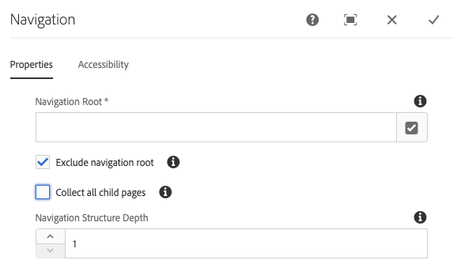

# 导航组件{#navigation-component}

导航组件允许用户轻松导航全球化的站点结构。

## 使用情况 {#usage}

导航组件列表列出了页面树，以便站点的用户可以轻松导航站点结构。

导航组件可自动检测站点的全球化站点结构并 [自动调整到本地化页面。](#localized-site-strucutre) 此外，它还可以使用 [阴影重定向页面](#shadow-structure) 来代表除主内容结构之外的其他结构，从而支持任意站点结构。

[编辑对话框](#edit-dialog) 允许内容作者定义导航根页面以及导航深度。[设计对话框](#design-dialog) 允许模板作者为导航根和深度定义默认值。

## 本地化站点结构支持 {#localized-site-structure}

网站通常以多种语言提供给不同地区。通常，每个本地化页面都将包含一个包含在页面模板中的导航元素。导航组件允许您在站点的所有页面上放置一次模板，然后根据全球化站点结构自动针对各个本地化页面进行调整。

* 有关导航组件的本地化功能如何工作的示例，请参见下面 [](#example-localiatzion)的部分。
* 有关核心组件的本地化功能如何协同工作的示例，请参阅核心组件页面 [的本地化功能](localization.md)。

### 示例 {#example-localization}

比如说，您的内容如下所示：

```
/content
+-- we-retail
   +-- language-masters
      +-- de
         \-- experience
            \-- arctic-surfing-in-lofoten
      +-- en
         \-- experience
            \-- arctic-surfing-in-lofoten
      +-- es
      +-- fr
      \-- it
   +-- us
      +-- en
         \-- experience
            \-- arctic-surfing-in-lofoten
      \-- es
   \-- ch
      +-- de
         \-- experience
            \-- arctic-surfing-in-lofoten
      +-- fr
      \-- it
+-- wknd-events
\-- wknd-shop
```

对于站点We. Retail，您很可能希望将导航组件放置在页面模板中作为标题的一部分。在模板的一部分中，您可以设置组件 **的导航根** ， `/content/we-retail/language-masters/en` 因为该站点是站点的主内容开始的位置。您可能还希望将 **导航结构深度** 设置为， `2` 因为您可能不希望组件显示整个内容树，而是显示前两个级别，因此它用作概述。

导航组件通过导航 **根** 值知道导航开始后 `/content/we-retail/language-masters/en` ，它可以生成导航选项，方法是将站点结构的两级向下重复(由 **导航结构深度** 值定义)。

无论用户查看哪个本地化页面，导航组件都可以通过了解当前页面的位置找到相应的本地化页面，从而向后工作到相应的页面，然后转发到相应页面。

因此，如果访客正在查看 `/content/ch/de/experience/arctic-surfing-in-lofoten`，则该组件会根据需要生成导航结构 `/content/we-retail/language-masters/de`。同样，如果访客正在查看 `/content/us/en/experience/arctic-surfing-in-lofoten`，则该组件会根据需要生成导航结构 `/content/we-retail/language-masters/en`。

## 阴影站点结构支持 {#shadow-structure}

有时，必须为访客创建一个不同于实际站点结构的导航菜单。也许促销活动应通过重新排列内容列表来突出显示菜单中的特定内容。使用阴影页面直接重定向到其他内容页面，导航组件可以生成任意需要的导航结构。

为此，您需要：

1. 将阴影页面创建为表示所需站点结构的特定页面。这通常称为阴影站点结构。
1. 在这些页面的页面路径中设置 **重定向** 值，以指向实际的内容页面。
1. 在阴影页面的页面属性中设置 **“隐藏in Navigation** ”选项。
1. 将导航组件的 **导航根** 值设置为指向新阴影站点结构的根。

导航组件随后将根据阴影站点结构渲染菜单。由组件渲染的链接指向阴影页面重定向到的实际内容页面，而不是阴影页面本身。此外，组件会显示实际页面的名称并正确突出显示活动页面，即使导航基于阴影页面也是如此。导航组件有效地使阴影页面对访客完全透明。

>[!NOTE]
>阴影页面使您的导航选项变得更灵活，但请记住，此结构的作用是完全手动操作。如果重新排列实际的站点内容或添加/删除内容，则需要根据需要手动更新阴影结构。

>[!NOTE]
>渲染阴影站点结构时，导航逻辑只会重复显示阴影页面。逻辑并不重复重定向目标的结构。

## 版本和兼容性 {#version-and-compatibility}

导航组件的当前版本是v1，它是在2018年月版的核心组件中引入的，它在文档中进行了介绍。

下表详细说明了组件的所有支持版本、组件版本的AEM版本以及以前版本的文档链接。

| 组件版本 | AEM 6.3 | AEM 6.4 | AEM 6.5 |
|--- |--- |--- |--- |
| v1 | 兼容 | 兼容 | 兼容 |

有关核心组件版本和版本的更多信息，请参阅文档 [核心组件版本](versions.md)。

## 示例组件输出 {#sample-component-output}

要体验导航组件以及查看其配置选项的示例以及HTML和JSON输出，请访问 [组件库](http://opensource.adobe.com/aem-core-wcm-components/library/navigation.html)。

## 技术详细信息 {#technical-details}

有关导航组件 [的最新技术文档，请参阅GitHub](https://github.com/adobe/aem-core-wcm-components/blob/master/content/src/content/jcr_root/apps/core/wcm/components/navigation/v1/navigation)。

有关开发核心组件的更多详细信息，请参阅 [核心组件开发人员文档](developing.md)。

>[!NOTE]
>
>从核心组件版本2.1.0开始，导航组件支持 [schema.org微型数据](https://schema.org)。

## Edit Dialog {#edit-dialog}

在编辑对话框中，内容作者可以定义导航的根页面和导航结构的深度。

### 属性选项卡 {#properties-tab}



* **导航根**&#x200B;根页面，用于生成导航树。
* **排除导航根目录**&#x200B;排除生成树中的导航根，仅包括其后代。
* **收集所有子页面**&#x200B;收集导航根后代的所有页面。
* **导航结构深度**&#x200B;定义组件应相对于导航根显示的导航树级别的级别(仅当未选择所有子页面 **** 时才可用)。

### 辅助功能选项卡 {#accessibility-tab}


在 **辅助功能** 选项卡上，可以为组件设置 [AIR辅助功能](https://www.w3.org/WAI/standards-guidelines/aria/) 标签的值。

* **标签** -组件的ARRIA标签属性的值

## 设计对话框 {#design-dialog}

设计对话框允许模板作者为内容作者设置导航根页面和导航深度的默认值。

### 属性选项卡 {#properties-tab-design}


* **导航根**&#x200B;导航结构根页面的默认值，用于生成导航树并在内容作者将组件添加到页面时默认使用该值。
* **不包括导航根**&#x200B;选项用于排除生成树中导航根的选项的默认值。
* **收集所有子页面**&#x200B;此选项的默认值用于收集导航根的所有后代的所有页面。
* **导航结构深度**&#x200B;导航结构深度的默认值。

### 样式选项卡 {#styles-tab}

导航组件支持AEM [Style System](authoring.md#component-styling)。
