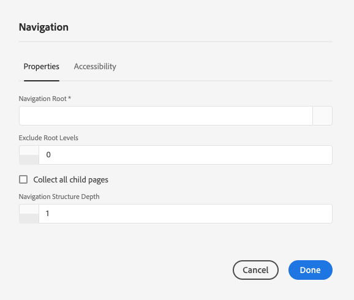

# 导航组件{#navigation-component}

导航组件允许用户轻松导航全球化的站点结构。

## 使用情况 {#usage}

导航组件会列出一个页面树，以便站点的用户能够轻松地导航站点结构。

导航组件可以自动检测网站的全球化站点结构并 [自动适应本地化页面。](#localized-site-structure) 此外，它还可以通过使用阴影重定向页面来表示 [除主内容结构以外的其他结构](#shadow-structure) ，从而支持任何任意站点结构。

在编 [辑对话框中](#edit-dialog) ，内容作者可以定义导航根页面以及导航深度。 设计 [](#design-dialog) 对话框允许模板作者为导航根和深度定义默认值。

## 本地化的站点结构支持 {#localized-site-structure}

网站通常针对不同区域以多种语言提供。 通常，每个本地化的页面都将包含作为页面模板的一部分包含的导航元素。 导航组件允许您将其放置在站点所有页面的模板上一次，然后它会根据您的全球化站点结构自动适应各个本地化页面。

* 有关导航组件的本地化功能如何工作的示例，请参 [阅以下部分](#example-localization)。
* 有关核心组件的本地化功能如何协同工作的示例，请参阅核 [心组件的本地化功能页面](localization.md)。

### 示例 {#example-localization}

假设您的内容类似于：

```
/content
+-- we-retail
   +-- language-masters
      +-- de
         \-- experience
            \-- arctic-surfing-in-lofoten
      +-- en
         \-- experience
            \-- arctic-surfing-in-lofoten
      +-- es
      +-- fr
      \-- it
   +-- us
      +-- en
         \-- experience
            \-- arctic-surfing-in-lofoten
      \-- es
   \-- ch
      +-- de
         \-- experience
            \-- arctic-surfing-in-lofoten
      +-- fr
      \-- it
+-- wknd-events
\-- wknd-shop
```

对于站点We.Retail，您可能希望将导航组件作为标题的一部分放置在页面模板上。 模板一旦加入，您就可以将组件的 **导航根** (Navigation Root `/content/we-retail/language-masters/en` )设置为，因为这是站点的主内容开始的位置。 您可能还希望将“导航结构深度 **”设置为**`2` ，因为您可能不希望组件显示整个内容树，而是希望前两个级别显示，以便它作为概述。

使用“导 **航根**`/content/we-retail/language-masters/en`**** ”值，导航组件知道在导航开始后，它可以通过向下递归站点的结构（由“导航结构深度”值定义）来生成导航选项。

无论用户查看的是哪个本地化页面，导航组件都可以通过了解当前页面的位置找到相应的本地化页面，然后返回到根页面，然后转发到相应的页面。

因此，如果访客正在查 `/content/ch/de/experience/arctic-surfing-in-lofoten`看，则组件会基于生成导航结构 `/content/we-retail/language-masters/de`。 同样，如果访客正在查 `/content/us/en/experience/arctic-surfing-in-lofoten`看，则组件知道根据生成导航结构 `/content/we-retail/language-masters/en`。

## 阴影站点结构支持 {#shadow-structure}

有时，需要为访客创建一个与实际站点结构不同的导航菜单。 或许促销应通过重新排列内容列表来突出显示菜单中的特定内容。 使用阴影页面（只重定向到其他内容页面），导航组件可以生成任何必要的任意导航结构。

为此，您需要：

1. 将阴影页面创建为表示所需站点结构的空页面。 这通常称为阴影站点结构。
1. 在这些页 **面的页面属性中** ，设置重定向值以指向实际的内容页面。
1. 在阴影 **页面的页面属性中** ，设置“在导航中隐藏”选项。
1. 设置导 **航组件的“导航根** ”值以指向新阴影站点结构的根。

导航组件随后将根据阴影站点结构呈现菜单。 组件呈现的链接指向阴影页面本身重定向到的实际内容页面，而不是指向阴影页面本身。 此外，组件还会显示实际页面的名称，并正确高亮显示活动页面，即使导航基于阴影页面。 导航组件有效地使阴影页面对访客完全透明。

>[!NOTE]
>阴影页面使您的导航选项更加灵活，但请记住，此结构的维护随后将完全手动进行。 如果重新排列实际的站点内容或添加／删除内容，则需要根据需要手动更新阴影结构。

>[!NOTE]
>渲染阴影站点结构时，导航逻辑只会递归阴影页面。 该逻辑不再返回重定向目标的结构。

## 版本和兼容性 {#version-and-compatibility}

导航组件的当前版本为v1,v1是2018年1月随核心组件版本2.0.0引入的，本文档对此进行了说明。

下表详细列出了组件的所有受支持版本、与组件版本兼容的AEM版本，以及指向先前版本的文档的链接。

| 组件版本 | AEM 6.3 | AEM 6.4 | AEM 6.5 |
|--- |--- |--- |--- |
| v1 | 兼容 | 兼容 | 兼容 |

有关核心组件版本和版本的详细信息，请参阅文档核 [心组件版本](versions.md)。

## 示例组件输出 {#sample-component-output}

要体验导航组件以及查看其配置选项的示例以及HTML和JSON输出，请访问组 [件库](http://opensource.adobe.com/aem-core-wcm-components/library/navigation.html)。

## 技术详细信息 {#technical-details}

有关导航组件的最新技术文 [档可在GitHub上找到](https://github.com/adobe/aem-core-wcm-components/blob/master/content/src/content/jcr_root/apps/core/wcm/components/navigation/v1/navigation)。

有关开发核心组件的更多详细信息，请参阅核 [心组件开发人员文档](developing.md)。

>[!NOTE]
>
>自核心组件版本2.1.0起，导航组件支持 [schema.org microdata](https://schema.org)。

## Edit Dialog {#edit-dialog}

在编辑对话框中，内容作者可以定义导航的根页面和导航结构的深度。

### 属性选项卡 {#properties-tab}



* **导航根** -将用于生成导航树的根页面。
* **排除根级别** -通常情况下，导航中不应包括根。 此选项允许您指定要从根目录向上排除的级别数。 例如：
   * 0 =显示根级别
   * 1 =排除根级别
   * 2 =排除根并向上增加1个级别
   * 以此类推。
* **收集所有子页面** -收集所有作为导航根目录的后代的页面。
* **导航结构深度** -定义组件在导航树中相对于导航根目录显示的级别数(仅在未选择“收集所有子页面 **** ”时可用)。

### 辅助功能选项卡 {#accessibility-tab}


在“辅 **助功能** ”选项卡上 [，可为组件的](https://www.w3.org/WAI/standards-guidelines/aria/) ARIA辅助功能标签设置值。

* **标签** -组件的ARIA标签属性的值

## 设计对话框 {#design-dialog}

设计对话框允许模板作者设置向内容作者显示的导航根页面和导航深度的默认值。

### 属性选项卡 {#properties-tab-design}


* **导航根** -导航结构的根页面的默认值，将用于生成导航树，并在内容作者将组件添加到页面时默认值。
* **排除根级别** -通常情况下，导航中不应包括根。 此选项允许您指定要从根目录中排除的默认级别数。 例如：
   * 0 =显示根级别
   * 1 =排除根级别
   * 2 =排除根并向上增加1个级别
   * 以此类推。
* **收集所有子页面** -用于收集所有作为导航根目录的后代页面的选项的默认值。
* **导航结构深度** -导航结构深度的默认值。

### 样式选项卡 {#styles-tab}

导航组件支持AEM样 [式系统](authoring.md#component-styling)。
