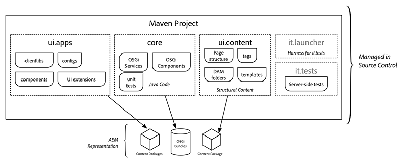

# AEM Project Archetype {#aem-project-archetype}

AEM Project Archetype可创建基于最小、最佳实践的Adobe Experience manager项目，作为您自己的AEM项目的起点。 使用此原型时必须提供的属性允许您指定此项目所有部分的名称，并控制某些可选特征。

>[!NOTE]
>
>GitHub上提供最新的AEM Project Archetype和完整 [的技术详细信息](https://github.com/adobe/aem-project-archetype)。

>[!NOTE]
>
>有关 [](https://docs.adobe.com/content/help/en/experience-manager-learn/getting-started-wknd-tutorial-develop/overview.html) 指导您逐步使用架构类型来实施简单项目的实用示例，请参阅AEM文档中的AEM Sites - WKND教程入门。

## 功能 {#features}

原型具有许多功能，旨在为新AEM项目提供便捷的起点：

* 包含示例内容的英语和法语页面
* 基于可编辑模板功能的内容模板（包含示例内容策略）
* 基于 [AEM页面核心组件的页面组件](page.md)
* 使用推荐的代理模式实现的内容组件示例和基于 [AEM核心组件的Helloworld自定义组件示例](introduction.md)。
* 表单组 [件示例](form-container.md)
* 设备模拟器、拖放设置和国际化的配置
* 遵循BEM命名约定以及组件特定样式的客户端库
* 示例包，包括示例模型、服务器、过滤器和调度程序
* 单元、集成和客户端测试

## 为什么使用原型 {#why-use-the-archetype}

使用AEM Project Archetype，您只需按几下键，即可在构建基于最佳实践的AEM项目的道路上前进。 通过使用原型，所有部分都将到位，这样，虽然生成的项目最少，但它已实施AEM的所有主要功能 [](#features) ，因此您只需在顶部构建并扩展即可。

当然，进入成功的AEM项目的元素很多，但使用AEM项目原型是可靠的基础，强烈建议对任何AEM项目使用。

## 你用原型得到什么 {#what-you-get}

AEM Archetype由模块组成：

* **[核心](core.md)**:是一个Java捆绑包，它包含所有核心功能（如OSGi服务、监听器和调度程序），以及与组件相关的Java代码（如servlet和请求过滤器）。
* **[ui.apps](uiapps.md)**:包含 `/apps` 项目 `/etc` 的和部分，即JS和CSS客户端库、组件、模板、特定于运行模式的配置以及Hobbes测试。
* **[ui.content](uicontent.md)**:包含使用ui.apps模块中的组件的示例内容。
* **ui.tests**:是一个Java包，包含执行服务器端的JUnit测试。 此捆绑包不会部署到生产上。
* **ui.launcher**:包含将ui.tests包（和从属包）部署到服务器并触发远程JUnit执行的粘胶代码。
* **[ui.frontend](front-end-build.md)**:可 [选] ，包含使用基于Webpack的前端构建模块所需的工件。



在Maven中表示的AEM Archetpye的模块作为表示应用程序、内容和必需OSGi包的内容页面部署到AEM。

## 要求 {#requirements}

原型的当前版本具有以下要求：

* Adobe Experience Manager 6.3.3.0或更高版本
* Apache Maven（3.3.9或更高版本）
* Maven设置中的Adobe Public Maven Repository。 有关详细信息， [请参阅此知识库文章](https://helpx.adobe.com/experience-manager/kb/SetUpTheAdobeMavenRepository.html)。

有关先前原型版本的受支持AEM版本的列表，请参阅历 [史支持的AEM版本](https://github.com/adobe/aem-project-archetype/blob/master/VERSIONS.md)。

## 如何使用原型 {#how-to-use-the-archetype}

要使用原型，您首先需要创建一个项目，该项目在本地文件结构中生成模块，如之 [前所述](#what-you-get)。 在项目生成过程中，可以为项目定义许多属性，如项目名称、版本等。

使用Maven构建项目可创建可部署到AEM的对象（包和OSGi包）。 其他Maven命令和配置文件可用于将项目对象部署到AEM实例。

### 创建项目 {#create-project}

要开始使用，您大多只需使用 [AEM Eclipse扩展](https://helpx.adobe.com/experience-manager/6-5/sites/developing/using/aem-eclipse.html) ，然后按照“新建项目”向导操作并选择“ **AEM示例多模块项目”** ，即可使用已发布版本的原型。

当然，您也可以直接调用Maven。

```
mvn archetype:generate \
 -DarchetypeGroupId=com.adobe.granite.archetypes \
 -DarchetypeArtifactId=aem-project-archetype \
 -DarchetypeVersion=XX
```

其中 `XX` 是最新 [的AEM Project Archetype的版本号](https://github.com/adobe/aem-project-archetype/blob/master/VERSIONS.md) 。

>[!NOTE]
>
>最好将配置文件添 `adobe-public` 加到Maven文件 `settings.xml` 中，以便自动将repo.adobe.com添加到Maven构建过程。
>
>这里可 [以找到POM示例](https://helpx.adobe.com/experience-manager/kb/SetUpTheAdobeMavenRepository.html)。

### 属性 {#properties}

在使用原型创建项目时，以下属性可用。

| 名称 | 默认 | 描述 |
----------------------------|---------|--------------------
| `groupId` |  | Base Maven `groupId` |
| `artifactId` |  | 基本Maven ArtifactId |
| `version` |  | 版本 |
| `package` |  | Java源包 |
| `appsFolderName` |  | `/apps` 文件夹名称 |
| `artifactName` |  | Maven项目名称 |
| `componentGroupName` |  | AEM组件组名称 |
| `contentFolderName` |  | `/content` 文件夹名称 |
| `confFolderName` |  | `/conf` 文件夹名称 |
| `cssId` |  | 生成的css中使用的前缀 |
| `packageGroup` |  | 内容包组名称 |
| `siteName` |  | AEM站点名称 |
| `optionAemVersion` | 6.5.0 | 目标AEM版本 |
| `optionIncludeExamples` | y | 包括组 [件库示例](http://opensource.adobe.com/aem-core-wcm-components/library.html) 站点 |
| `optionIncludeErrorHandler` | n | 包含自定义404响应页 |
| `optionIncludeFrontendModule` | n | [包括专用前端模块](front-end-build.md) |

>[!NOTE]
> 如果首次在交互模式中执行原型，则无法更改具有默认值的属性(有关详细信息，请参阅 [ARCHETYPE-308](https://issues.apache.org/jira/browse/ARCHETYPE-308) )。 当结束时的属性确认被拒绝并且调查表被重复时，或者通过在命令行中传递参数(例如， `-DoptionIncludeExamples=n`)。

### 个人资料 {#profiles}

运行时，生成的主项目支持不同的部署配置文件 `mvn install`。

| 个人资料ID | 描述 |
--------------------------|------------------------------
| `autoInstallBundle` | 将带有maven-sling-plugin的核心捆绑包安装到OSGi |
| `autoInstallPackage` | 将ui.content和ui.apps内容包与content-package-maven-plugin一起安装到包管理器中，该包管理器位于localhost上的默认作者实例4502端口。 主机名和端口可以使用和用 `aem.host` 户定 `aem.port` 义的属性进行更改。 |
| `autoInstallPackagePublish` | 将ui.content和ui.apps内容包与content-package-maven-plugin一起安装到包管理器，以在localhost（端口4503）上默认发布实例。 主机名和端口可以使用和用 `aem.host` 户定 `aem.port` 义的属性进行更改。 |
| `integrationTests` | 在AEM实例上运行提供的集成测试(仅针对阶 `verify` 段) |

### 构建和安装 {#building-and-installing}

要构建在项目根目录中运行的所有模块，请使用以下Maven命令。

```
mvn clean install
```

如果您有正在运行的AEM实例，则可以构建并打包整个项目，然后使用以下Maven命令部署到AEM中。

```
mvn clean install -PautoInstallPackage
```

要将其部署到发布实例，请运行此命令。

```
mvn clean install -PautoInstallPackagePublish
```

或者，要部署到发布实例，请运行此命令。

```
mvn clean install -PautoInstallPackage -Daem.port=4503
```

或者，要仅将包部署到作者，请运行此命令。

```
mvn clean install -PautoInstallBundle
```

## 父POM {#parent-pom}

项 `pom.xml` 目(`<src-directory>/<project>/pom.xml`)的根部称为父POM，它驱动项目的结构并管理依赖关系和项目的某些全局属性。

### 全局项目属性 {#global-properties}

父 `<properties>` POM的部分定义了若干全局属性，这些属性对于在AEM实例上部署您的项目很重要，例如用户名／密码、主机名／端口等。

这些属性设置为部署到本地AEM实例，因为这是开发人员将执行的最常见的构建。 注意，有一些属性可部署到作者实例和发布实例。 此外，凭据也会设置为与AEM实例进行身份验证。 使用默认admin:admin凭据。

设置这些属性，以便在部署到更高级别环境时可以覆盖它们。 这样，POM文件就不必更改，但诸如和之类的变量 `aem.host` 可以 `sling.password` 通过命令行参数覆盖：

````
mvn -PautoInstallPackage clean install -Daem.host=production.hostname -Dsling.password=productionpasswd
````

### 模块结构 {#module-structure}

父 `<modules>` POM的部分定义项目将构建的模块。 默认情况下，项目会构 [建先前定义的标准模块](#what-you-get):核心、ui.apps、ui.content、ui.tests和it.launcher。 随着项目的发展，可以始终添加更多模块。

### 依赖关系 {#dependencies}

父 `<dependencyManagement>` POM的部分定义项目中使用的所有依赖关系和API版本。 应在父POM中管理版本。 核心和ui.apps等子模块不应包括任何版本信息。

#### Uber-Jar {#uber-jar}

其中一个关键依赖项是 [AEM uber-jar](https://helpx.adobe.com/experience-manager/6-5/sites/developing/using/ht-projects-maven.html#ExperienceManagerAPIDependencies)。 这将包括所有AEM API，只包含AEM版本的一个依赖项。

>[!NOTE]
>
>作为最佳实践，您应更新uber-jar版本以匹配AEM的目标版本。 例如，如果您计划部署到AEM 6.4，则应将uber-jar的版本更新到6.4.0。

#### 核心组件 {#core-components}

AEM项目原型当然会利用核心组件。

核心组件自动安装在AEM中的默认运行模式下，并由示例We.Retail站点使用。 在生产 [运行模式](https://helpx.adobe.com/experience-manager/6-5/sites/administering/using/production-ready.html) (`nosamplecontent`)中，核心组件不可用。

因此，为了在所有部署中利用核心组件，最好将其包含在Maven项目中。

>[!NOTE]
>
>每个版本的核心组件通常随后都会发布AEM Project Archtype，以便最新的架构使用最新版本的核心组件。
>
>但是，新版本的原型可能不会直接遵循新版本的核心组件，因此您可能希望将对核心组件的依赖性更新到最新版本。

>[!NOTE]
>
>core.wcm.components.examples是一组示例页，用于说明核心组件的示例。 作为最佳实践，在为生产部署项目时，您应删除此依赖关系和子包包含。

## 测试 {#testing}

项目中包含三个级别的测试，由于它们是不同类型的测试，因此它们以不同的方式或在不同的位置执行。

* 核心单元测试：这将显示捆绑包中包含的代码的经典单元测试。 要测试，请执行：
   * `mvn clean test`
* 服务器端集成测试：这些测试在AEM环境（即在AEM服务器上）中运行类似单元的测试。 要测试，请执行：
   * `mvn clean verify -PintegrationTests`
* 客户端Hobbes.js测试：这些是基于JavaScript的浏览器端测试，用于验证浏览器端行为。 测试：
   1. 在浏览器中加载AEM，就像创作页面一样。
   1. Open the page in [Developer mode](https://helpx.adobe.com/experience-manager/6-5/sites/developing/using/developer-mode.html)
   1. 打开左侧面板并切换到“ **Tests** （测试）”选项卡。
   1. 查找生成的 **MyName测试** ，并运行它们。

## 后续步骤 {#next-steps}

因此，您已构建并安装了AEM Project Archetype。 现在怎么办？ 原型很小，但包含许多根据推荐的最佳实践配置的强大AEM功能示例。 使用这些指示指示您可以如何在项目中利用这些功能。 对于任何可能需要执行的项目：

* [自定义组件以扩展现有的核心组件](customizing.md)
* [添加其他模板](https://helpx.adobe.com/content/help/en/experience-manager/6-5/sites/authoring/using/templates.html)
* [调整本地化结构](https://helpx.adobe.com/experience-manager/6-5/sites/administering/using/tc-prep.html)
* [了解前端构建模块](front-end-build.md)
