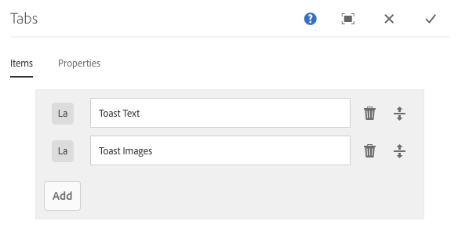

# 选项卡组件

核心组件选项卡组件允许将内容组织到多个选项卡上。

## 使用情况 {#usage}

选项卡组件允许内容作者在多个选项卡中组织页面内容。

[编辑对话框](#edit-dialog) 允许内容作者定义多个选项卡以及设置活动选项卡。使用 [设计对话框](#design-dialog)，模板作者可以定义可将哪些组件添加到选项卡并自定义样式。

>[!NOTE]
>
>支持嵌套选项卡组件(选项卡中的选项卡)。
>
>简单(非嵌套)选项卡组件可使用 [内容树进行定位/选择](https://helpx.adobe.com/experience-manager/6-5/sites/authoring/using/author-environment-tools.html)，但嵌套选项卡不能。

## 版本和兼容性 {#version-and-compatibility}

选项卡组件的当前版本是v1，它是在2018年10月版核心组件中引入的，它在本文档中进行了介绍。

下表详细说明了组件的所有支持版本、组件版本的AEM版本以及以前版本的文档链接。

| 组件版本 | AEM 6.3 | AEM 6.4 | AEM 6.5 |
|--- |--- |--- |--- |
| v1 | 兼容 | 兼容 | 兼容 |

有关核心组件版本和版本的更多信息，请参阅文档 [核心组件版本](versions.md)。

## 示例组件输出 {#sample-component-output}

以下是取自 [We. Retail](https://helpx.adobe.com/experience-manager/6-5/sites/developing/using/we-retail.html)的示例。

### 屏幕快照 {#screenshot}

### 组件库

要体验选项卡组件以及其配置选项的示例以及HTML和JSON输出，请访问 [组件库](http://opensource.adobe.com/aem-core-wcm-components/library/tabs.html)。

### 技术详细信息 {#technical-details}

有关选项卡组件 [的最新技术文档，请参阅GitHub](https://github.com/adobe/aem-core-wcm-components/blob/master/content/src/content/jcr_root/apps/core/wcm/components/tabs/v1/tabs)。

有关开发核心组件的更多详细信息，请参阅 [核心组件开发人员文档](developing.md)。

## 编辑对话框 {#edit-dialog}

编辑对话框允许内容作者创建、重命名和重新排列选项卡以及定义活动选项卡。

### 项目选项卡 {#items-tab}

使用 **“添加** ”按钮打开组件选择器，以选择要添加为选项卡的组件。添加后，条目会添加到列表中，其中包含以下列：

* **图标** -选项卡的组件类型的图标，用于在列表中轻松标识。将鼠标悬停在鼠标上可查看整个组件名称作为工具提示。
* **描述** -用作选项卡文本的说明，默认为选项卡所选的组件名称。
* **删除** -点按或单击可从选项卡组件中删除选项卡。
* **重新排列** -点按或单击并拖动可重新排列选项卡的顺序。

### 属性选项卡 {#properties-tab}

在 **属性** 选项卡上，内容作者可以定义加载页面时活动的选项卡。使用 **默认** 选项，将选择第一个选项卡。

## 选择面板 {#select-panel}

内容作者可以使用组件工具栏上的 **“选择面板** ”选项更改为其他面板进行编辑，并轻松重新排列选项卡的顺序。

在组件工具栏中选择 **“选择面板** ”选项后，配置的选项卡将显示为下拉列表。

* 列表由选项卡分配的排列排序，并反映在编号中。
* 将首先显示选项卡的组件类型，后跟较亮字体中的选项卡描述。

* 点击或单击下拉菜单中的条目，将编辑器中的视图切换到该选项卡。
* 使用拖动手柄可以就地重新排列选项卡。

>[!NOTE]
>
>在 **编辑** 模式下作者不可选择选项卡。使用 [**预览** 模式](https://helpx.adobe.com/experience-manager/6-5/sites/authoring/using/editing-content.html) 或 **[“查看已发布”](https://helpx.adobe.com/experience-manager/6-5/sites/authoring/using/editing-content.html)** 选项可与已发布内容的读者交互选项卡进行交互。

## 设计对话框 {#design-dialog}

设计对话框允许模板作者定义可将哪些组件添加为选项卡组件的项目，以及定义内容作者可用的自定义样式。

### 允许的组件选项卡 {#allowed-components-tab}

**允许的组件** 选项卡用于定义内容作者可以将哪些组件添加为选项卡组件的项目。

在模板编辑器中 [定义布局容器的策略和属性时，允许的组件选项卡功能与同名选项卡相同。](https://helpx.adobe.com/experience-manager/6-5/sites/authoring/using/templates.html)

### 样式选项卡 {#styles-tab}

选项卡组件支持AEM [Style System](authoring.md#component-styling)。