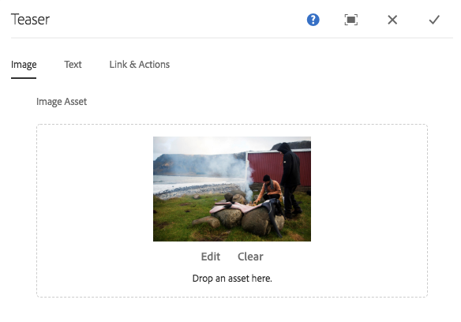

# Teaser组件{#teaser-component}

核心组件Teaser组件可显示图像、标题、富文本以及可选链接到进一步内容。

## 使用情况 {#usage}

Teaser组件允许内容作者轻松创建使用图像、标题或丰富文本并链接到其他内容或其他操作的Teaser。

模板作者可以使用 [设计对话框](#design-dialog) 来定义创建行动动员和添加链接的选项以及禁用各种显示选项。内容作者可以使用 [配置对话框](#configure-dialog) 设置图像、定义CTA、设置标题和描述以及配置指向单个Teaser的链接。[可以访问](image.md#edit-dialog)[图像组件](image.md) 的编辑对话框以修改Teaser图像。

## 版本和兼容性 {#version-and-compatibility}

Teaser组件的当前版本为v1，该版本是在2018年月核心组件中引入的，它是在核心组件中引入的，它在文档中进行了介绍。

下表详细说明了组件的所有支持版本、组件版本的AEM版本以及以前版本的文档链接。

| 组件版本 | AEM 6.3 | AEM 6.4 | AEM 6.5 |
|---|---|---|---|
| v1 | 兼容 | 兼容 | 兼容 |

## 示例组件输出 {#sample-component-output}

以下是取自 [We. Retail](https://helpx.adobe.com/experience-manager/6-5/sites/developing/using/we-retail.html)的示例。

### 屏幕快照 {#screenshot}

### 组件库

要体验Teaser组件以及查看其配置选项的示例以及HTML和JSON输出，请访问 [组件库](http://opensource.adobe.com/aem-core-wcm-components/library/teaser.html)。

### 技术详细信息 {#technical-details}

有关Teaser组件 [的最新技术文档，请参阅GitHub](https://github.com/adobe/aem-core-wcm-components/blob/master/content/src/content/jcr_root/apps/core/wcm/components/teaser/v1/teaser)。

有关开发核心组件的更多详细信息，请参阅 [核心组件开发人员文档](developing.md)。

## 配置对话框 {#configure-dialog}

内容作者可以使用配置对话框定义单个Teaser的属性。如果选择了teaser图像，还有一个 [编辑对话框](#edit-dialog) 可修改Teaser图像。

### 图像 {#image}

* **图像资产**
   * 从 [资产浏览器中拖放资产](https://helpx.adobe.com/experience-manager/6-5/sites/authoring/using/author-environment-tools.html) 或点击 **浏览** 选项以从本地文件系统上传。
   * 点按或单击 **清除** 可取消选择当前选定的图像。
   * 点按或单击 **编辑** 可 [在资产编辑器](https://helpx.adobe.com/experience-manager/6-5/assets/using/managing-assets-touch-ui.html) 中合并资产的演绎版。

### 文本 {#text}

* **标题**定义要作为Teaser标题显示的标题。
* **从链接页面**获取标题在选中后，标题将填充链接页面的标题。
* **描述**定义要显示为Teaser子标题的描述。
* **获取链接页面**的说明后，将使用链接页面的描述填充描述。

### 链接和操作 {#links-actions}

* **链接**链接应用于Teaser。使用路径浏览器选择链接目标。
* **选中“在选中时**启用行动动员”选项可定义“行动动员”的定义。列表中的第一个“调用行动动员”链接用作其他Teaser元素的链接。

## 编辑对话框 {#edit-dialog}

Teaser组件将图像渲染委托到 [图像组件](image.md)。因此 [，编辑对话框](图像组件的图像. md# edit-dialog可用于内容作者操作teaser图像。

## 设计对话框 {#design-dialog}

设计对话框允许模板作者定义内容作者在使用此组件时所拥有的Teaser选项。

### Teaser选项卡 {#teaser-tab}

* **行为召唤**
   * **为内容作者禁用“调用行动**”隐藏“ **行动动员”** 选项
* **元素**
   * **隐藏标题**
      * 隐藏内容作者的 **标题** 选项
      * When selected the **Title Type** is hidden
   * **隐藏说明**隐藏内容作者 **的说明** 选项
* **标题类型**定义要由Teaser标题使用的H标记。
* **链接**
   * **不链接图像**当选定时，Teaser图像未链接
   * **不链接标题**当选中时，Teaser标题未链接

### 样式选项卡 {#styles-tab}

Teaser组件支持AEM [Style System](authoring.md#component-styling)。
