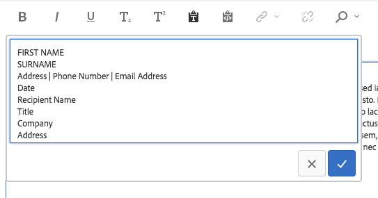
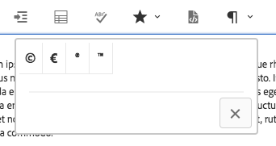
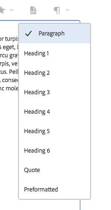
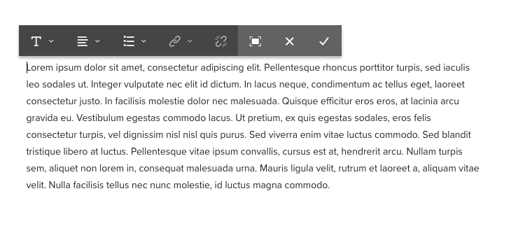
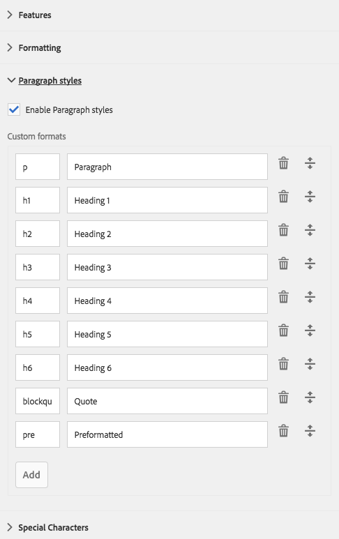

# 文本组件{#text-component}

核心组件文本组件是一种丰富的文本编辑和构图组件，可进行就地编辑。

## 使用情况 {#usage}

文本组件提供了强大的富文本编辑器，它允许以简化的线内编辑器以及全屏格式轻松编辑文本。

[编辑对话框](#edit-dialog) 具有有限的选项，可在全屏编辑对话框中提供具有完整功能的有限选项。使用 [设计对话框](#design-dialog)，可以为内容作者的模板配置标题、特殊字符和段落样式等文本格式选项。

## 版本和兼容性 {#version-and-compatibility}

文本组件的当前版本是v2，它是在2018年月核心组件发行版中引入的，它在本文档中进行了介绍。

下表详细说明了组件的所有支持版本、组件版本的AEM版本以及以前版本的文档链接。

| 组件版本 | AEM 6.3 | AEM 6.4 | AEM 6.5 |
|---|---|---|---|
| v2 | 兼容 | 兼容 | 兼容 |
| [v1](text-v1.md) | 兼容 | 兼容 | 兼容 |

有关核心组件版本和版本的更多信息，请参阅文档 [核心组件版本](versions.md)。

## 示例组件输出 {#sample-component-output}

以下是取自 [We. Retail](https://helpx.adobe.com/experience-manager/6-5/sites/developing/using/we-retail.html)的示例。

### 屏幕快照 {#screenshot}

### 组件库

要体验文本组件以及查看其配置选项的示例以及HTML和JSON输出，请访问 [组件库](http://opensource.adobe.com/aem-core-wcm-components/library/text.html)。

### 技术详细信息 {#technical-details}

有关文本组件 [的最新技术文档可在GitHub](https://github.com/adobe/aem-core-wcm-components/blob/master/content/src/content/jcr_root/apps/core/wcm/components/text/v2/text)上找到。

有关开发核心组件的更多详细信息，请参阅 [核心组件开发人员文档](developing.md)。

## 文本组件和富文本编辑器 {#the-text-component-and-the-rich-text-editor}

核心组件文本组件利用AEM富文本编辑器(RTE)。RTE为内容作者提供了各种功能，用于编辑其文本内容。RTE在其配置中非常灵活，并提供许多选项。有关如何配置RTE的更多详细信息，请参阅 [文章配置富文本编辑器](https://helpx.adobe.com/experience-manager/6-5/sites/administering/using/rich-text-editor.html) 和 [配置富文本编辑器插件](https://helpx.adobe.com/experience-manager/6-5/sites/administering/using/configure-rich-text-editor-plug-ins.html)。

本文的其余部分演示了核心组件文本组件与现成RTE配置的标准配置。

>[!NOTE]
>
>文本组件 [中只提供RTE](https://chl-author-preview.corp.adobe.com/content/help/en/experience-manager/6-5/sites/administering/using/rich-text-editor.html) 配置支持的选项。

## 编辑对话框 {#edit-dialog}

编辑对话框提供用户期望撰写文本的标准富文本格式设置工具。

### 粗体

用于将粗体格式应用于选定文本，或粗体格式(在光标之后输入)。

**Ctrl+ B** 可用作键盘快捷键。

### 斜体

用于将斜体格式应用于选定文本，或斜体文本(在光标之后输入)。

**Ctrl+ I** 可用作键盘快捷键。

### 下划线

用于对选定文本应用带下划线的格式或在光标之后输入下划线文本。

**Ctrl+ U** 可用作键盘快捷键。

### 下标

用于设置在光标之后输入的选定文本或文本的格式。

### 上标

用于将选定文本或在光标之后输入的文本设置为上标。

### 粘贴文本

将任何复制的文本粘贴为纯文本，而无需任何格式。

选择此选项时，将打开一个窗口，在该窗口中，文本可以作为纯文本粘贴，而不会作为预览插入到文本中。通过点按或单击复选标记接受，通过点按或单击x取消。

### 从 Word 粘贴

选择此选项时，将打开一个窗口，在该窗口中可以在将文本插入文本之前将其格式保留为预览。通过点按或单击复选标记接受，通过点按或单击x取消。

### 超链接

使用此选项可将选定文本转换为超链接或修改已定义的链接。此选项仅在已选择文本时处于活动状态，并且打开了一个窗口，其中包含用于设置链接的其他选项。

* 输入位置
   * 使用打开选择对话框在AEM中选择路径
   * 如果链接不在AEM内，请输入绝对URL(非绝对路径将解释为相对于AEM)
* 为链接输入替代描述性文本
* 选择链接行为
   * 目标
   * 相同选项卡
   * 新选项卡
   * 父框架
   * 顶层框架
   点按或单击复选标记以应用链接或x以取消。

### 取消链接

使用此选项可删除已应用于选定文本的链接。仅当已选择链接时，此选项才处于活动状态。

### 查找

使用此选项可搜索文本以匹配指定文本字符串。选择此选项将打开一个窗口，用于指定搜索选项。

输入要搜索的文本，然后点按或单击 **查找** 以开始搜索。点按或单击x以取消。
如果要根据具体情况进行精确匹配，请在开始搜索之前选择 **“匹配大小写** ”选项。
如果找到匹配项，则突出显示，搜索对话框将灰显。在灰显对话框中再次点按或单击 **“查找”** 按钮以搜索下一个匹配项。

如果未找到其他实例，则会显示一条消息，并且搜索将从文本开始开始。

### 替换

使用此选项可搜索指定文本字符串的实例，并用其他字符串替换匹配项。选择此选项将打开一个窗口，用于指定搜索和替换选项。

输入要搜索的文本以及应替换的文本。

点按或单击 **查找** 以开始搜索。单击或点按x以取消。

如果要根据具体情况进行精确匹配，请在开始搜索之前选择 **“匹配大小写** ”选项。

如果找到匹配项，则突出显示，搜索对话框将灰显。再次单击灰显对话框中的 **“查找”** 按钮可搜索下一个匹配项，或选择 **替换** 按钮以替换突出显示的、匹配的文本。请注意 **，只有在完成匹配后，“替换** ”按钮才处于活动状态。

选择 **全部替换** 以一次性替换文本的所有实例。

### 左对齐文本

用于将文本对齐到左边距。

### 居中对齐文本

用于居中对齐文本。

### 右对齐文本

用于将文本对齐到右边距。

### Bullet

用于将选定文本格式化为项目符号列表，或开始在光标之后插入项目符号列表。

要结束项目符号列表，请再次点按或单击 **“项目符号** ”按钮，或输入两个回车符。

### 编号

用于将选定文本格式化为编号列表，或开始在光标之后插入编号列表。

要结束编号列表，请再次点按或单击 **“已编号** ”按钮或输入两个回车符。

### 突出

用于减小选定文本的缩进级别或光标之后输入的文本。

仅处于活动状态，如果光标的选定文本或位置已缩进。

### 缩进

用于增加选定文本的缩进级别或光标之后输入的文本。

### 表

用于在文本中插入表。选择此选项将打开一个窗口，用于指定表的详细信息。

* **列**表的列数(必需)
* **行**表的行数(必需)
* **宽度**表的宽度
* **高度**表的高度
* **单元格填充**单元格内容周围的空间
* **单元格间距**单元格之间的间距
* **边框**表边框的粗细
* 如果表标题为：
   * 应使用第一行
   * 应使用第一列
   * 应使用第一行和第一列
   * 或者不应使用标题。
* **题注**的题注

### 拼写检查

用于检查文本内容的拼写。可能的拼写错误带有断开的红色线条。

有关拼写检查和自定义拼写检查词典的更多详细信息，请 [参阅配置富文本编辑器插件](https://helpx.adobe.com/experience-manager/6-5/sites/administering/using/configure-rich-text-editor-plug-ins.html)。

### 特殊字符 {#special-characters}

用于在文本中插入特殊字符。选择此选项将打开显示可用字符的窗口。

点按或单击所需的字符，将其插入光标之后的文本。可以插入多个字符。点按或单击x以关闭选择窗口。

### 编辑源文件

用于查看和修改文本的HTML源。

点按或单击 **“源编辑** ”图标以更改格式视图中的文本内容以查看原始HTML。在此模式中，将禁用所有其他格式选项。再次点按或单击 **“源编辑** ”图标以返回到带格式的视图。

>[!CAUTION]
>
>与原始HTML的访问情况一样，在使用 **源编辑** 选项时，必须谨慎小心！
>
>会扫描通过 **“源编辑** ”输入的HTML，并且会删除插入的任何脚本，而不会显示在生成页面上的任何脚本。但是 **，在“源编辑** ”中输入的格式不正确的HTML可能会破坏页面的模板，从而导致意外格式设置或呈现生成页面不可用。

>[!NOTE]
>
>由于通过“源编辑 **** ”输入的HTML会扫描为XSS风险和任何脚本并自动删除那些脚本，因此实际内容会因 **“源编辑**”中输入的内容而有所不同。因此，为了保存使用 **源编辑**所做的更改，您必须先退出 **“源编辑”，** 才能在保存之前查看常规编辑器中的文本。

### 段落格式

用于将段落格式应用于选定文本或光标之后插入的文本。选择此选项将打开一个从中选择段落格式的下拉菜单。

文本组件也可以进行内嵌编辑，但由于空间restraints，并非所有格式选项都可用。要查看所有选项，请切换到全屏模式。

## 设计对话框 {#design-dialog}

设计对话框允许模板作者定义内容作者可用的文本格式选项。

### 插件选项卡 {#plugins-tab}

插件选项卡用于启用和禁用内容作者可用的各种文本格式选项。

### 功能 {#features}

可以为组件激活或取消激活下列功能。

* 粘贴纯文本
* 过去的语言
* 查找和替换
* 拼写检查器
* 源编辑

### 格式化 {#formatting}

可以为组件激活或取消激活以下格式选项。

* 表
* 列表
* 对齐
* 粗体、斜体、下划线
* 链接
* 子/上标

### 段落样式 {#paragraph-styles}

可以为组件激活或取消激活段落样式。激活后，可以定义允许的格式。

* 点按或单击 **“添加** ”按钮以插入新样式。
* 输入样式的代码和将在编辑对话框中显示的描述。
* 要删除样式，请点击或单击 **删除** 按钮。
* 要重新排列格式的顺序，请点按或单击并拖动手柄。

### 配置特殊字符 {#configuring-special-characters}

可以为组件激活或取消激活插入特殊字符的选项。激活后，可定义允许的字符。

* 点按或单击 **添加** 按钮以插入新字符。
* 输入字符的HTML代码和将在编辑对话框中显示的描述。
* 要删除字符，请点击或单击 **删除** 按钮。
* 要重新排列字符的顺序，请点按或单击并拖动手柄。

## 样式选项卡 {#styles-tab}

文本组件支持AEM [样式系统](authoring.md#component-styling)。