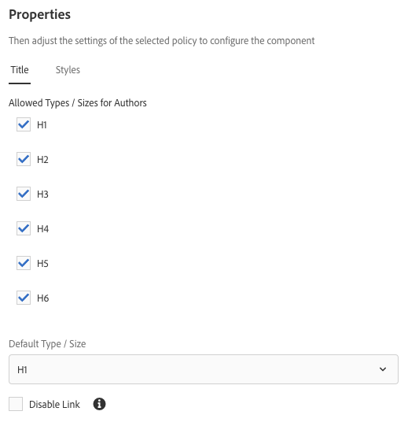

# 标题组件{#title-component}

核心组件标题组件是具有就地编辑功能的章节标题组件。

## 使用情况 {#usage}

标题组件旨在用作内容部分的标题或标题。可用的标题级别可由设计对话框中的模板作者 [定义](#design-dialog)。内容编辑器可以从 [编辑对话框](#edit-dialog)中的可用标题级别中进行选择。为了方便起见，还提供了简单的位置文本就地编辑功能。

## 版本和兼容性 {#version-and-compatibility}

标题组件的当前版本为v2，它是在2018年月核心组件发行版中引入的，该版本在本文档中进行了介绍。

下表详细说明了组件的所有支持版本、组件版本的AEM版本以及以前版本的文档链接。

| 组件版本 | AEM 6.3 | AEM 6.4 | AEM 6.5 |
|---|---|---|---|
| v2 | 兼容 | 兼容 | 兼容 |
| [v1](title-v1.md) | 兼容 | 兼容 | 兼容 |

有关核心组件版本和版本的更多信息，请参阅文档 [核心组件版本](versions.md)。

## 示例组件输出 {#sample-component-output}

以下示例取自 [We. Retail](https://helpx.adobe.com/experience-manager/6-5/sites/developing/using/we-retail.html)。

### 屏幕快照 {#screenshot}

### 组件库

要体验标题组件以及查看其配置选项的示例以及HTML和JSON输出，请访问 [组件库](http://opensource.adobe.com/aem-core-wcm-components/library/title.html)。

### 技术详细信息 {#technical-details}

有关标题组件 [的最新技术文档可在GitHub](https://github.com/adobe/aem-core-wcm-components/blob/master/content/src/content/jcr_root/apps/core/wcm/components/title/v2/title)上找到。

有关开发核心组件的更多详细信息，请参阅 [核心组件开发人员文档](developing.md)。

## 编辑对话框 {#edit-dialog}

编辑对话框允许内容作者定义标题文本以及选择标题级别。

* **标题** -如果空，将使用页面标题
* **类型/大小** -定义标题的标题级别
* **链接** -定义标题将链接到的内容。这可以是内容页面、外部URL或页面锚点的路径。

>[!CAUTION]
>
>在核心组件的版本2.2.0中引入了为标题定义链接的功能。

就地编辑器还可用于编辑标题组件的文本。

## 设计对话框 {#design-dialog}

设计对话框允许模板作者定义内容作者创建时标题组件将具有的默认标题级别。

### 大小选项卡 {#sizes-tab}

* **作者允许的类型/大小** -启用或禁用内容作者使用标题组件时可使用的标题类型。
* **默认类型/大小**-定义内容作者将标题组件添加到页面时将自动分配的标题类型。
* **禁用**链接-禁用标题组件中的链接支持，以禁止内容作者从标题链接。

>[!CAUTION]
>
>在核心组件的版本2.2.0中引入了为标题定义链接的功能。

### 样式选项卡 {#styles-tab}

标题组件支持AEM [Style System](authoring.md#component-styling)。